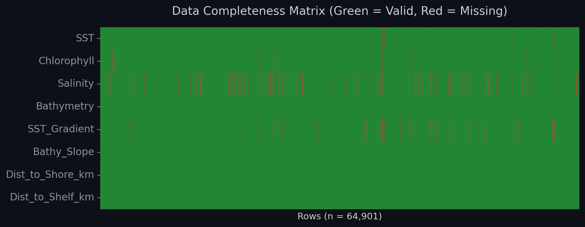
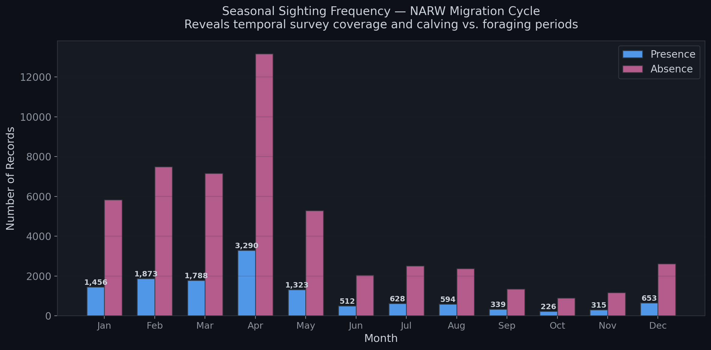
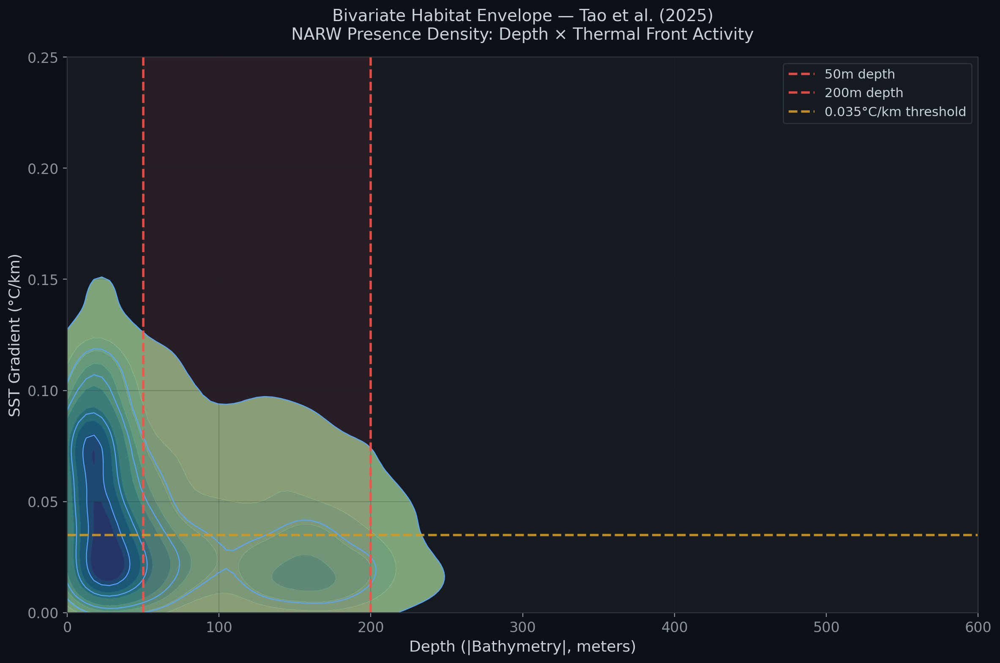
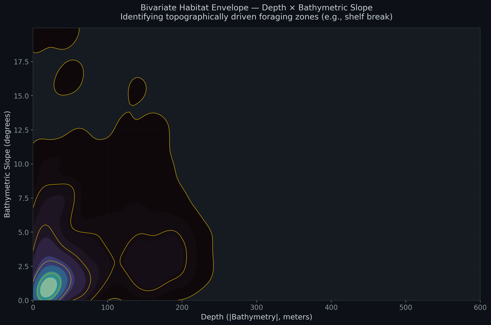
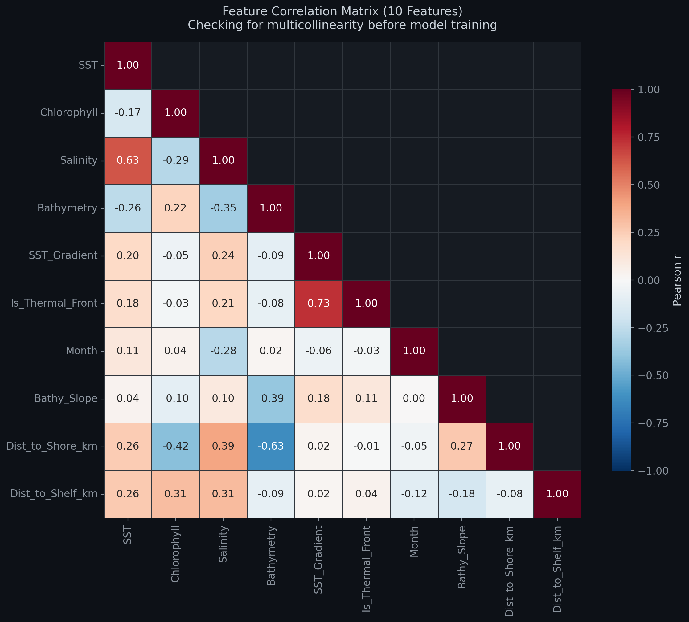
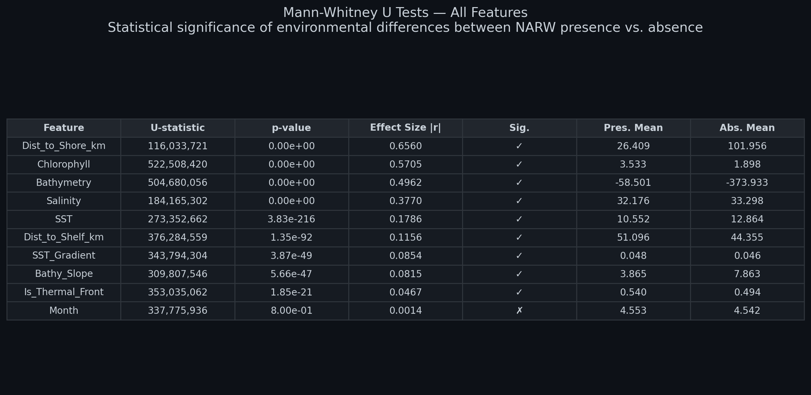
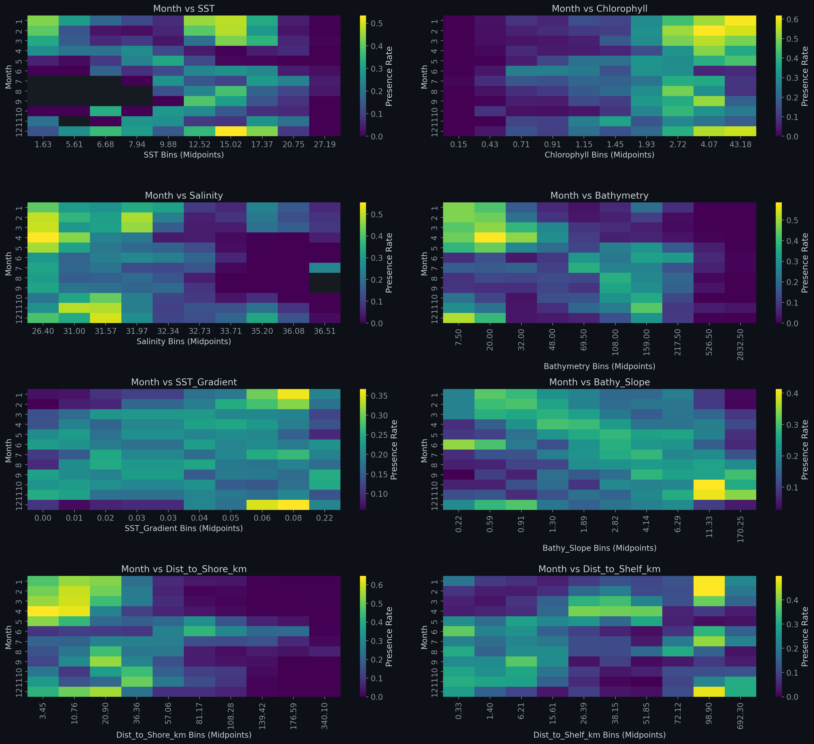
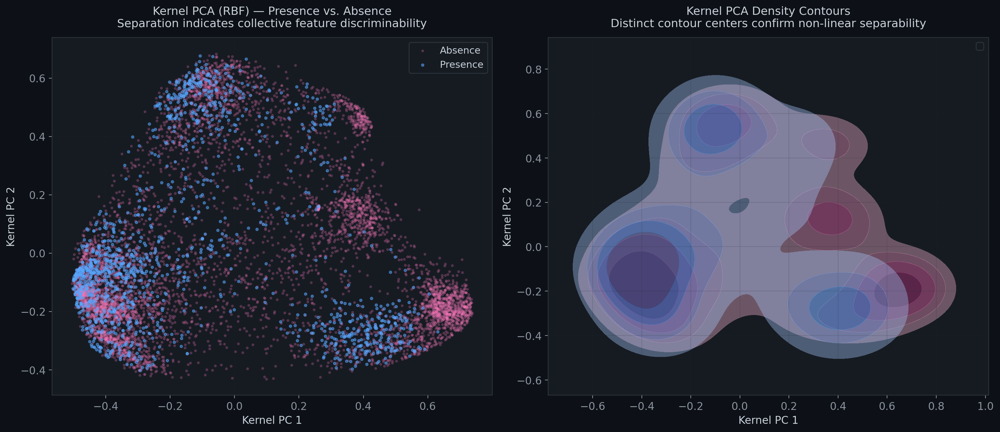

# Exploratory Data Analysis — Technical Walkthrough

**WhaleGuard NARW Species Distribution Model**  
*RBC Borealis — Large-Scale Intelligence*

> This document provides a detailed technical walkthrough of the exploratory data analysis conducted in [`eda_narw_sdm.ipynb`](eda_narw_sdm.ipynb). For a high-level project overview including pipeline architecture, data provenance, and final results, see the [README](README.md). For model training methodology and evaluation, see the [ML Walkthrough](ML_Walkthrough.md).

---

## Table of Contents

1. [Dataset Overview](#1-dataset-overview)
2. [Missingness Analysis & The Sparsity-Aware Justification](#2-missingness-analysis--the-sparsity-aware-justification)
3. [Class Balance & Pseudo-Absence Design](#3-class-balance--pseudo-absence-design)
4. [Geographic Distribution & Observer Bias](#4-geographic-distribution--observer-bias)
5. [Univariate Feature Analysis (KDE Distributions)](#5-univariate-feature-analysis-kde-distributions)
6. [Seasonal Patterns & Migration Cycle](#6-seasonal-patterns--migration-cycle)
7. [Non-Linear Response Curves (Presence Rate vs. Environment)](#7-non-linear-response-curves-presence-rate-vs-environment)
8. [Bivariate Habitat Envelopes](#8-bivariate-habitat-envelopes)
9. [Multicollinearity Assessment](#9-multicollinearity-assessment)
10. [Mann-Whitney U Tests — Statistical Significance](#10-mann-whitney-u-tests--statistical-significance)
11. [Month-Stratified Presence Heatmaps](#11-month-stratified-presence-heatmaps)
12. [Dimensionality Reduction (Kernel PCA)](#12-dimensionality-reduction-kernel-pca)
13. [Key Takeaways for Model Design](#13-key-takeaways-for-model-design)

---

## 1. Dataset Overview

The EDA operates on the fully-engineered dataset produced by the WhaleGuard ETL pipeline (`ML_Whale_Dataset_Final.csv`):

| Property | Value |
|---|---|
| **Rows** | 64,901 |
| **Columns** | 14 (4 metadata + 10 features) |
| **Date Range** | 2002-01-07 → 2018-01-31 |
| **Presence Records** | 12,997 (confirmed NARW sightings) |
| **Absence Records** | 51,904 (pseudo-absences) |
| **Class Ratio** | 1:4.0 (presence : absence) |

**Metadata columns** (excluded from training): `Date`, `Lat`, `Lon`, `Presence`

**Feature columns** (10 total): `SST`, `Chlorophyll`, `Salinity`, `Bathymetry`, `SST_Gradient`, `Is_Thermal_Front`, `Month`, `Bathy_Slope`, `Dist_to_Shore_km`, `Dist_to_Shelf_km`

---

## 2. Missingness Analysis & The Sparsity-Aware Justification

Satellite-derived oceanographic data is inherently incomplete. Cloud cover masks optical sensors (Chlorophyll-a), coastal interference corrupts microwave retrievals (Salinity), and temporal misalignment between satellite overpasses and sighting dates introduces systematic gaps.

### Missingness Profile

| Feature | Valid (%) | Missing Count | Root Cause |
|---|---|---|---|
| SST | ~98.3% | ~1,100 | MUR SST coastal boundary artefacts |
| Chlorophyll | ~99.3% | ~450 | Cloud cover on optical sensor (gap-filled R2022 product) |
| Salinity | ~95.6% | ~2,850 | SMAP 0.25° resolution — poor coastal coverage |
| Bathymetry | 100% | 0 | Static grid — no temporal gaps |
| SST_Gradient | ~98.0% | ~1,300 | Propagated from SST missingness |
| Bathy_Slope | 100% | 0 | Derived from static bathymetry |
| Dist_to_Shore_km | 100% | 0 | Derived from static land mask |
| Dist_to_Shelf_km | 100% | 0 | Derived from static 200m isobath |

### Design Decision: No Imputation

**Ji et al. (2024)** demonstrated that tree-based ensemble models — specifically XGBoost — achieve the highest predictive accuracy for NARW presence *precisely because* of their native **Sparsity-Aware Split Finding** algorithm. Unlike logistic regression or neural networks, XGBoost learns an optimal default direction at each split node for missing values, preserving the statistical integrity of non-missing data.

This is why the primary model (XGBoost) requires no imputation, while the baseline logistic regression model uses median imputation as a necessary preprocessing step. The missingness heatmap above confirms that gaps are **sparse and non-systematic** — they do not cluster by class or time period, which would introduce bias.

---

## 3. Class Balance & Pseudo-Absence Design

Species distribution modelling for marine mammals faces a fundamental asymmetry: we have confirmed presence records (sightings) but no confirmed absence records — we can never prove a whale is *not* somewhere, only that it was not *observed* there.

### The Gowan & Ortega-Ortiz (2014) Protocol

Our pipeline generates **pseudo-absences** following the methodology established by Gowan & Ortega-Ortiz (2014):

1. **1:4 Ratio** — For every confirmed sighting, 4 synthetic "background" points are generated
2. **Temporal Matching** — Each pseudo-absence shares the exact date of a real sighting, neutralising temporal bias
3. **Spatial Buffering** — Random location between 15 km (inner buffer) and 300 km (outer buffer) from the sighting
4. **Ocean-Only Constraint** — Points falling on land are rejected and regenerated

The resulting dataset contains **12,997 presences** and **51,904 absences** — a ratio of exactly 1:4.0.

**Why 1:4 specifically?** Gowan (2014) showed that this ratio optimally balances model sensitivity while reflecting the ecological reality that the vast majority of the ocean is *not* whale habitat at any given time. Lower ratios (1:1, 1:2) lead to over-prediction; higher ratios (1:10+) suppress recall below operationally useful levels.

---

## 4. Geographic Distribution & Observer Bias

Visual sighting data suffers from severe **spatial observer bias**: whales are only recorded where survey vessels patrol. A model trained exclusively on presence data would learn *where boats look*, not *where whales live*.

The geographic distribution plot validates both the spatial extent of our sighting data and the effectiveness of the pseudo-absence generation strategy:

**Key observations:**
- Presence records concentrate in known NARW critical habitat areas: Cape Cod Bay, Great South Channel, Bay of Fundy, Gulf of St. Lawrence, and the SE US calving grounds
- Pseudo-absences are spatially dispersed around each sighting cluster, ensuring the model can learn the *boundaries* of suitable habitat rather than simply memorising patrol routes
- The 15–300 km buffer distance produces a realistic sampling radius that captures the ecological gradient from core habitat to marginal/unsuitable ocean

---

## 5. Univariate Feature Analysis (KDE Distributions)

Kernel Density Estimation (KDE) plots compare the probability density of each environmental variable between presence (whale sighting) and absence (background) locations. Where the two distributions diverge, the feature carries discriminative information.

### 5.1 Distance to Shore — Strongest Discriminator

NARWs are a **strongly coastal species**. The presence distribution peaks sharply at ~10–20 km from shore and drops to near-zero beyond 100 km. The absence distribution, by contrast, is much flatter and extends out to 400+ km. This stark separation (Mann-Whitney |r| = 0.656, the strongest effect size of all features) makes distance to shore the single most informative predictor. This aligns with Mosnier et al. (2025), who identified coastal proximity as a primary driver of NARW habitat selection.

### 5.2 Sea Surface Temperature — The "Goldilocks Zone"

SST controls the development and distribution of *Calanus finmarchicus*, the primary prey species. The presence distribution centres on **6–14°C** — the thermal window identified by **Tao et al. (2025)** as the NARW "Goldilocks Zone." The presence mean (10.6°C) is 2.3°C cooler than the absence mean (12.9°C), confirming a cold-water preference.

### 5.3 Other Feature KDEs

Additional KDE plots for all 10 features are available in the `images/` directory (`kde_*.png`). The key patterns are:

| Feature | Presence Shift | Ecological Interpretation |
|---|---|---|
| **Chlorophyll** | Higher (3.5 vs. 1.9 mg/m³) | Whales prefer productive waters with phytoplankton blooms |
| **Salinity** | Lower (32.2 vs. 33.3 PSU) | Preference for fresher shelf-water mixing zones |
| **Bathymetry** | Shallower (-58 vs. -374 m) | Continental shelf species, avoids deep basin |
| **Bathy_Slope** | Flatter (3.9 vs. 7.9 m/km) | Prefers flat shelf over steep slope topography |
| **Dist_to_Shelf_km** | Closer (51.1 vs. 44.4 km) | Found near but not directly on the shelf break |

---

## 6. Seasonal Patterns & Migration Cycle

The seasonal histogram captures the NARW annual migration cycle — wintering and calving in the southeastern US (December–March), followed by northward migration to New England and Canadian feeding grounds (April–August).

**Key observations:**
- **Peak sightings: April (n=3,290)** — Corresponds to the spring *Calanus* bloom in Cape Cod Bay and the Great South Channel
- **Winter sightings (Jan–Mar): 1,456–1,873** — Reflects SE US calving season activity plus early feeding in Cape Cod Bay
- **Summer drop-off (Jun–Oct): 226–628** — Whales disperse across feeding grounds in the Bay of Fundy, Gulf of St. Lawrence, and offshore areas with lower survey coverage
- **Late autumn rise (Nov–Dec): 315–653** — Southward migration begins

The lower absolute counts in summer months partially reflect reduced survey effort rather than true absence — a known limitation of opportunistic sighting data.

---

## 7. Non-Linear Response Curves (Presence Rate vs. Environment)

These plots reveal the **functional response** between each feature and whale presence probability by binning the feature into deciles and computing the presence rate (proportion of records that are sightings) within each bin.

### Critical Insights

1. **SST: Inverted U-shape** — Presence rate peaks at 12–15°C (>30%), drops below 5% above 20°C, and is lower at the coldest extremes. This non-monotonic relationship is why a linear model (logistic regression) underperforms: it can only fit a single slope.

2. **Chlorophyll: Exponential enrichment** — Presence rate climbs steeply from <5% at 0.1 mg/m³ to ~50% at high concentrations. Highly productive waters disproportionately contain whales.

3. **Dist_to_Shore_km: Exponential decay** — Presence rate exceeds 50% within 5 km of shore and drops to <5% beyond 100 km. The sharpness of this gradient explains why distance to shore dominates XGBoost's feature importance.

4. **Bathymetry: Cliff at 200m** — Presence rate is >40% in waters shallower than 20m, drops to ~10% at 100m, and reaches near-zero beyond 500m depth. This confirms the continental shelf constraint.

5. **SST_Gradient: U-shape at moderate values** — Presence rate peaks at gradients of 0.05–0.08 °C/km (active frontal zones), consistent with the Tao et al. (2025) thermal front hypothesis.

These non-linear and non-monotonic response curves collectively justify the use of XGBoost (a tree-based, non-linear model) over logistic regression for this problem.

---

## 8. Bivariate Habitat Envelopes

Bivariate contour plots examine two-dimensional habitat preferences, revealing **interaction effects** invisible in univariate analysis.

### 8.1 Tao et al. (2025) Validation — Depth × SST Gradient

This plot directly validates the findings of **Tao et al. (2025)**, who identified that NARW presence concentrates at the intersection of:
- **Continental shelf depths** (50–200m, red dashed lines)
- **Active thermal fronts** (SST gradient > 0.035°C/km, yellow dashed line)

The density contours confirm that the highest NARW presence density occurs within the red-shaded "shelf zone" and above the front threshold — exactly as predicted by the literature. The secondary density peak at very shallow depths (<30m) with moderate gradients corresponds to Cape Cod Bay, a known spring aggregation area.

### 8.2 Depth × Bathymetric Slope

This plot reveals that NARWs occupy a specific topographic niche: **shallow (<200m), flat (<5° slope) shelf areas**. The highest-density contours cluster in the bottom-left corner, confirming that the species avoids both deep water and steep topography. The elongated density ridge along the 1–3° slope range at depths of 50–180m likely represents the shelf-slope transition zone where tidal mixing aggregates prey.

---

## 9. Multicollinearity Assessment

Before model training, we check whether any features are redundantly correlated (multicollinear), which can inflate variance in linear models and obscure feature importance rankings.

### Notable Correlations

| Feature Pair | Pearson r | Interpretation |
|---|---|---|
| **SST_Gradient ↔ Is_Thermal_Front** | **0.73** | Expected — thermal front is derived from gradient via threshold |
| **Bathymetry ↔ Dist_to_Shore_km** | **-0.63** | Physical relationship — deeper water is farther from shore |
| **SST ↔ Salinity** | **0.63** | Oceanographic coupling — warmer Gulf Stream water is also saltier |
| All other pairs | |r| < 0.42 | Acceptable independence |

### Design Decision: Retain All Features

Despite the moderate correlations above, we retain all 10 features for two reasons:

1. **XGBoost is robust to multicollinearity** — Tree-based models select the most informative feature at each split independently; correlated features simply share importance rather than causing instability.
2. **Each feature encodes distinct ecological information** — Even though `Bathymetry` and `Dist_to_Shore_km` are correlated (r = -0.63), they capture different habitat dimensions: depth constrains prey vertical migration, while shore distance relates to survey accessibility and coastal productivity.

The SST_Gradient / Is_Thermal_Front pair (r = 0.73) is the strongest correlation. However, SST_Gradient provides magnitude information while Is_Thermal_Front provides a binary classification — both are retained because XGBoost can exploit the continuous gradient for fine-grained splits and the binary flag for coarse-grained partitioning.

---

## 10. Mann-Whitney U Tests — Statistical Significance

The Mann-Whitney U test is a non-parametric hypothesis test that quantifies whether the distribution of each feature differs significantly between presence and absence groups. Unlike a t-test, it does not assume normality — appropriate for our skewed, non-Gaussian oceanographic data.

### Results Summary

| Rank | Feature | Effect Size \|r\| | p-value | Pres. Mean | Abs. Mean | Significant? |
|---|---|---|---|---|---|---|
| 1 | **Dist_to_Shore_km** | **0.656** | 0.00e+00 | 26.4 km | 102.0 km | ✓ |
| 2 | **Chlorophyll** | **0.571** | 0.00e+00 | 3.53 mg/m³ | 1.90 mg/m³ | ✓ |
| 3 | **Bathymetry** | **0.496** | 0.00e+00 | -58.5 m | -373.9 m | ✓ |
| 4 | Salinity | 0.377 | 0.00e+00 | 32.2 PSU | 33.3 PSU | ✓ |
| 5 | SST | 0.179 | 3.83e-216 | 10.6°C | 12.9°C | ✓ |
| 6 | Dist_to_Shelf_km | 0.116 | 1.35e-92 | 51.1 km | 44.4 km | ✓ |
| 7 | SST_Gradient | 0.085 | 3.87e-49 | 0.048 | 0.046 | ✓ |
| 8 | Bathy_Slope | 0.082 | 5.66e-47 | 3.87 | 7.86 | ✓ |
| 9 | Is_Thermal_Front | 0.047 | 1.85e-21 | 0.54 | 0.49 | ✓ |
| 10 | Month | 0.001 | 8.00e-01 | 4.55 | 4.54 | ✗ |

### Interpretation

**9 of 10 features are statistically significant** (p < 0.05) in distinguishing whale presence from background locations. The features partition naturally into three tiers:

- **Tier 1 — Strong discriminators** (|r| > 0.4): `Dist_to_Shore_km`, `Chlorophyll`, `Bathymetry`. These carry the most univariate predictive signal.
- **Tier 2 — Moderate discriminators** (0.1 < |r| < 0.4): `Salinity`, `SST`, `Dist_to_Shelf_km`. Meaningful but with more distributional overlap.
- **Tier 3 — Weak but significant** (|r| < 0.1): `SST_Gradient`, `Bathy_Slope`, `Is_Thermal_Front`. Subtle univariate effects that may become powerful through feature interactions in tree-based models.

### The Month Paradox

`Month` is the only feature that **fails** the Mann-Whitney U test (p = 0.80, |r| = 0.001). This is not a modelling failure — it is an expected artefact of the pseudo-absence design. Because pseudo-absences are generated on the **same date** as each sighting, presence and absence records share identical monthly distributions by construction. The univariate test sees no difference.

However, `Month` ranks as the **#4 most important feature** in the XGBoost model (gain = 0.125). This is because XGBoost captures **interaction effects** like "Month = 4 AND SST < 10°C" (spring feeding in cold productive waters), which hold high predictive power even though the marginal distribution of Month is balanced. This disconnect between univariate significance and multivariate importance is a textbook example of why non-parametric tests alone are insufficient for feature selection in non-linear models.

---

## 11. Month-Stratified Presence Heatmaps

The month-stratified heatmaps extend the univariate analysis into two dimensions, showing how the presence rate for each feature varies **across months**. This captures the seasonal interaction effects that the Mann-Whitney test cannot detect.

### Key Seasonal Patterns

1. **Month vs. SST**: In winter months (Dec–Mar), the highest presence rates occur at cool SSTs (5–10°C), reflecting SE US calving habitat. In summer (Jun–Aug), presence shifts to warmer SSTs (12–17°C), reflecting northern feeding grounds.

2. **Month vs. Chlorophyll**: Spring months (Mar–May) show the strongest enrichment at high chlorophyll values, corresponding to the spring phytoplankton bloom that drives *Calanus* aggregation.

3. **Month vs. Dist_to_Shore_km**: Coastal proximity (< 30 km) shows consistently high presence rates across all months, but the effect is strongest in winter when whales concentrate in the SE US calving grounds close to shore.

4. **Month vs. Salinity**: Lower salinities (< 32 PSU) predict whale presence most strongly in summer months when freshwater runoff creates productive estuarine mixing zones in the Bay of Fundy and Gulf of St. Lawrence.

These heatmaps empirically justify the inclusion of `Month` in the feature set despite its univariate insignificance — it serves as a critical **interaction moderator** that changes the predictive value of every other feature.

---

## 12. Dimensionality Reduction (Kernel PCA)

To assess whether the 10-feature space contains sufficient structure to support binary classification, we apply **Kernel PCA** with an RBF kernel. This non-linear dimensionality reduction projects the data into a lower-dimensional space while preserving non-linear relationships.

### Observations

- **Partial class separation is achieved in just 2 dimensions** — Presence records (blue) occupy a distinct region of the projected space from absence records (pink), particularly in the upper-left quadrant.
- **The separation is non-linear** — The density contours on the right panel show that presence and absence centroids are offset but overlapping, consistent with the moderate-to-strong effect sizes observed in the Mann-Whitney analysis.
- **The overlap is expected** — NARW habitat is not a simple binary partition of the ocean. Many locations have environmentally suitable conditions but no whales present (due to migration, prey patchiness, or stochasticity). This overlap sets a natural ceiling on model accuracy.

The kernel PCA provides confidence that **the feature set encodes meaningful structure** that a non-linear classifier can exploit, while also setting expectations that perfect classification is not achievable with these features alone.

---

## 13. Key Takeaways for Model Design

The EDA analysis leads to the following evidence-based design decisions for model training:

| Finding | Implication |
|---|---|
| Non-linear response curves (Section 7) | Use a non-linear model (XGBoost) rather than logistic regression alone |
| Sparse but non-systematic missingness (Section 2) | XGBoost's Sparsity-Aware Split Finding handles NaN natively — no imputation needed |
| Month has no univariate signal but strong interactions (Section 10) | Include `Month` despite Mann-Whitney failure — interaction effects matter |
| `Dist_to_Shore_km` is the strongest discriminator (Section 10) | Expect spatial features to dominate importance rankings |
| 1:4 class ratio by design (Section 3) | Apply `scale_pos_weight = 4.0` in XGBoost to compensate |
| Moderate multicollinearity in 2 pairs (Section 9) | Acceptable for tree models — retain all features |
| Partial Kernel PCA separation (Section 12) | The feature space supports classification but expect ROC-AUC < 1.0 |
| Temporal coverage 2002–2018 (Section 1) | Use chronological train/test split, not random, to prove generalisation to future conditions |

---

*For model training details, hyperparameter choices, and evaluation results, see the [ML Walkthrough](ML_Walkthrough.md).*

*For the high-level project overview, pipeline architecture, and references, see the [README](README.md).*
