# Machine Learning — Technical Walkthrough

**WhaleGuard NARW Species Distribution Model**  
*RBC Borealis — Large-Scale Intelligence*

> This document provides a detailed technical walkthrough of the model training, evaluation, and comparison conducted in [`train_logistic_regression.py`](train_logistic_regression.py), [`train_xgboost.py`](train_xgboost.py), [`train_random_forest.py`](train_random_forest.py), and [`manual_test.py`](manual_test.py). For the exploratory data analysis, see the [EDA Walkthrough](EDA_Walkthrough.md). For a high-level project overview, see the [README](README.md).

---

## Table of Contents

1. [Modelling Strategy](#1-modelling-strategy)
2. [Data Preparation & Temporal Split](#2-data-preparation--temporal-split)
3. [Model A: Logistic Regression (Baseline)](#3-model-a-logistic-regression-baseline)
4. [Model B: XGBoost](#4-model-b-xgboost)
5. [Model C: Random Forest](#5-model-c-random-forest)
6. [Threshold Optimisation for Conservation](#6-threshold-optimisation-for-conservation)
7. [Head-to-Head Comparison](#7-head-to-head-comparison)
8. [Feature Importance & Interpretability](#8-feature-importance--interpretability)
9. [Manual Inference Testing](#9-manual-inference-testing)
10. [Model Artefacts & Deployment](#10-model-artefacts--deployment)

---

## 1. Modelling Strategy

The WhaleGuard modelling strategy follows established ML research practice: **train a simple baseline model first, then compare it against more complex models to empirically justify the additional complexity.**

| Aspect | Logistic Regression (Baseline) | Random Forest | XGBoost |
|---|---|---|---|
| **Role** | Establishes interpretable lower bound | Bagged ensemble comparator | Boosted ensemble comparator |
| **Why chosen** | Provides coefficients and odds ratios for ecological interpretability | Quantifies the benefit of boosting over bagging; provides OOB error estimate | Handles non-linear interactions, missing values, and feature correlations natively |
| **Missing values** | Median imputation required | Median imputation required | Sparsity-Aware Split Finding (Ji et al., 2024) — no imputation |
| **Class imbalance** | `class_weight="balanced"` (auto-adjusts) | `class_weight="balanced_subsample"` (per-tree rebalancing) | `scale_pos_weight=4.0` (explicit ratio) |
| **Regularisation** | L2 Ridge (C=1.0) | `max_depth=20`, `min_samples_leaf=5` + bagging variance reduction | L1 + L2 (`reg_alpha=0.1`, `reg_lambda=1.0`) + `gamma=0.1` |

### Feature Exclusions

All three models train on the same **10 features** and explicitly **exclude** `Lat`, `Lon`, and `Date` from the feature set. This is a deliberate design decision:

- **Lat/Lon exclusion** forces the model to learn *ocean physics* (temperature, productivity, bathymetry) rather than memorise geographic coordinates. A model that memorises "this lat/lon had a whale" cannot generalise to new areas or account for range shifts under climate change.
- **Date exclusion** prevents temporal leakage. The `Month` feature is retained as a cyclical seasonal proxy, but the exact date is dropped to avoid overfitting to specific survey events.

---

## 2. Data Preparation & Temporal Split

### Split Strategy: Chronological (80/20)

Unlike random train/test splits, a **temporal split** places all data before a cutoff date into training and all data after it into testing. This proves the model can generalise to *future* conditions it has never seen — a much more demanding evaluation than random cross-validation.

| Set | Rows | Date Range | Presence | Absence |
|---|---|---|---|---|
| **Train** | 51,920 | 2002-01-07 → 2015-07-09 | ~10,200 | ~41,720 |
| **Test** | 12,981 | 2015-07-10 → 2018-01-31 | ~2,780 | ~10,200 |

**Split date:** 2015-07-10 (80th percentile chronologically)

The temporal split is critical for this application. Ship strike management requires predictions about *where whales will be tomorrow*, not where they were in historical data. A model that interpolates known dates is operationally useless; a model that extrapolates to unseen future conditions is deployable.

### Preprocessing Differences

| Step | Logistic Regression | Random Forest | XGBoost |
|---|---|---|---|
| Missing value handling | `SimpleImputer(strategy="median")` | `SimpleImputer(strategy="median")` | Native (no imputation) |
| Feature scaling | `StandardScaler(mean=0, std=1)` | Not required (tree-based) | Not required (tree-based) |
| Boolean encoding | `Is_Thermal_Front` cast to int | `Is_Thermal_Front` cast to int | `Is_Thermal_Front` cast to int |

The logistic regression pipeline chains these steps using `sklearn.Pipeline` to prevent data leakage — the scaler is fit only on training data and applied to test data.

---

## 3. Model A: Logistic Regression (Baseline)

### Hyperparameter Tuning

The regularisation strength `C` is tuned via `BayesSearchCV` (40 iterations) with `TimeSeriesSplit(n_splits=4)`, sampling from a log-uniform distribution to ensure equal coverage across orders of magnitude.

| Parameter | Value | Tuned? |
|---|---|---|
| `C` | **0.93** (selected by BayesSearchCV) | ✓ `Real(0.001, 100, log-uniform)` — Bayesian optimisation |
| `penalty` | L2 (Ridge) | Fixed — keeps all features for interpretability |
| `solver` | lbfgs | Fixed — efficient for L2 penalty |
| `max_iter` | 1000 | Fixed — ensures convergence |
| `class_weight` | balanced | Fixed — auto-compensates class imbalance |

**Best CV ROC-AUC: 0.8046.** The tuned C≈0.93 is very close to the default (1.0), confirming the original choice was near-optimal.

### Performance

| Metric | Value |
|---|---|
| **ROC-AUC** | 0.8048 |
| **Recall** | 0.8316 |
| **Precision** | 0.3387 |
| **F1-Score** | 0.4813 |
| **Accuracy** | 0.6392 |

The logistic regression achieves a respectable AUC of 0.805, confirming that the feature set carries meaningful signal. However, the low precision (33.9%) at high recall (83.2%) indicates that the linear decision boundary produces many false positives — locations where the model predicts whale presence but no whale is found.

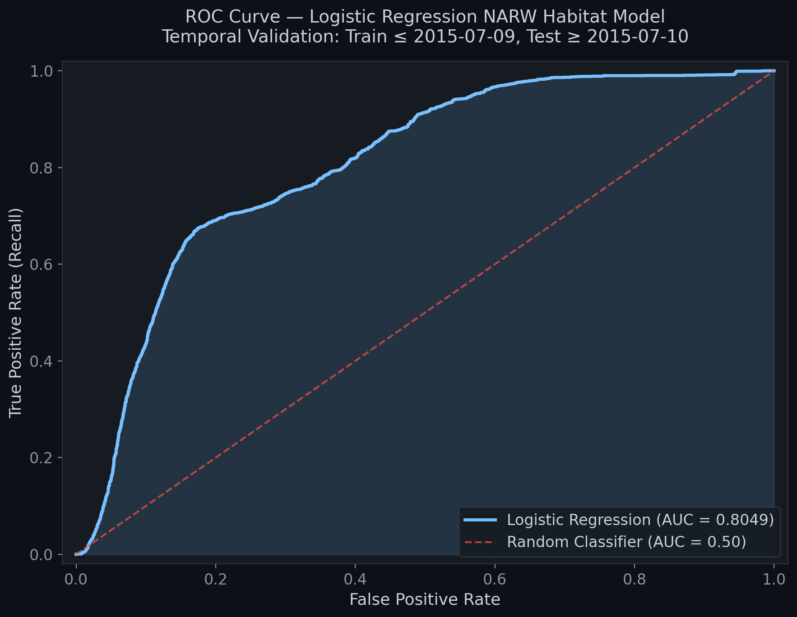

### Coefficient Analysis

Logistic regression coefficients (standardised) reveal the **direction and magnitude** of each feature's influence on whale presence probability:

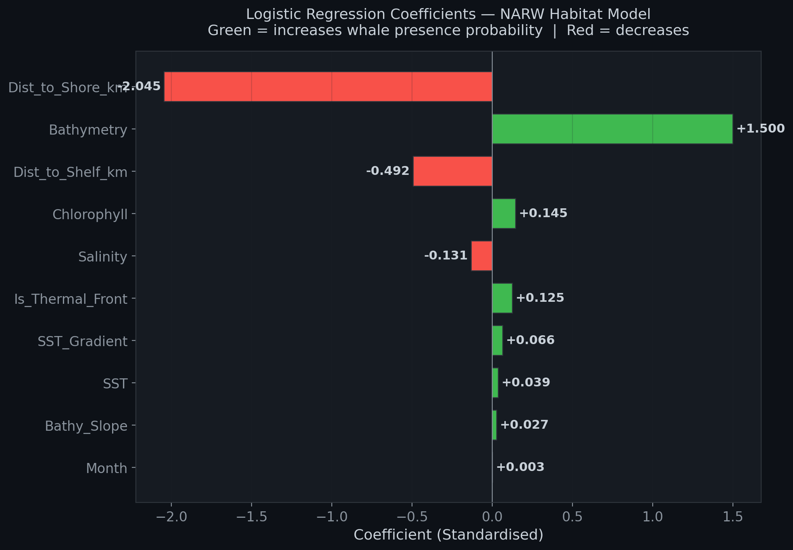

**Top coefficients by magnitude:**

| Rank | Feature | Coefficient | Odds Ratio | Interpretation |
|---|---|---|---|---|
| 1 | **Dist_to_Shore_km** | -2.044 | 0.130 | Each 1σ increase in distance to shore reduces whale odds by **87%** |
| 2 | **Bathymetry** | +1.500 | 4.482 | Each 1σ increase (shallower) increases odds by **348%** |
| 3 | **Dist_to_Shelf_km** | -0.496 | 0.609 | Farther from shelf break → 39% odds reduction |
| 4 | **Chlorophyll** | +0.144 | 1.155 | Higher productivity → 15.5% odds increase |
| 5 | **Salinity** | -0.131 | 0.877 | Saltier open-ocean water → 12.3% odds reduction |

**Ecological coherence check:** The coefficient signs match known NARW ecology — closer to shore (+), shallower water (+), more productive (+), fresher (+). This validates that the model is learning biologically meaningful relationships rather than artefacts.

**Month (coefficient = +0.003)** is nearly zero, confirming the Month Paradox discussed in the [EDA Walkthrough](EDA_Walkthrough.md#10-mann-whitney-u-tests--statistical-significance) — a linear model cannot exploit the interaction effects that make seasonality informative.

---

## 4. Model B: XGBoost

### Hyperparameter Tuning

XGBoost hyperparameters are tuned via `BayesSearchCV` (40 iterations) with `TimeSeriesSplit(n_splits=4)`, scoring on ROC-AUC. Search dimensions use `skopt.space` types for Bayesian optimisation with a Gaussian Process surrogate model.

**Best CV ROC-AUC: 0.9498**

| Parameter | Tuned Value | Search Distribution |
|---|---|---|
| `n_estimators` | **460** | `Integer(100, 800)` |
| `max_depth` | **7** | `Integer(3, 12)` |
| `learning_rate` | **0.034** | `Real(0.005, 0.3, log-uniform)` |
| `subsample` | **0.82** | `Real(0.5, 1.0)` |
| `colsample_bytree` | **0.88** | `Real(0.5, 1.0)` |
| `min_child_weight` | **8** | `Integer(1, 15)` |
| `gamma` | **0.15** | `Real(0, 0.5)` |
| `reg_alpha` | **0.42** | `Real(0.001, 5.0, log-uniform)` |
| `reg_lambda` | **0.63** | `Real(0.1, 10.0, log-uniform)` |
| `scale_pos_weight` | 4.0 | Fixed — compensates 1:4 class imbalance |
| `objective` | binary:logistic | Fixed |
| `tree_method` | hist | Fixed |

Using Bayesian optimisation instead of random or grid search allows the algorithm to model the objective function with a Gaussian Process surrogate and focus evaluation on promising regions of the parameter space, finding better hyperparameters in fewer iterations.

### Why XGBoost Over Logistic Regression?

Three architectural advantages make XGBoost the superior choice for this problem:

1. **Sparsity-Aware Split Finding** — XGBoost natively handles the ~1–5% NaN values in SST, Chlorophyll, and Salinity by learning an optimal default branch direction at each tree node. This eliminates the need for imputation, which can introduce bias (Ji et al., 2024).

2. **Non-Linear Feature Interactions** — Tree-based models capture conditional relationships like "SST < 10°C AND Month ∈ {3,4,5} AND Dist_to_Shore < 30km" that logistic regression cannot represent without manual feature engineering.

3. **Robustness to Multicollinearity** — The moderate correlations between Bathymetry/Dist_to_Shore (r = -0.63) and SST_Gradient/Is_Thermal_Front (r = 0.73) do not destabilise XGBoost as they would in a linear model.

### Default Threshold Performance (τ = 0.50)

| Metric | Value |
|---|---|
| **ROC-AUC** | 0.9042 |
| **Recall** | 0.6778 |
| **Precision** | 0.6744 |
| **F1-Score** | 0.6761 |
| **Accuracy** | 0.8693 |

At the default threshold, the tuned XGBoost achieves a **+10.0 pp AUC improvement** over logistic regression (0.9042 vs. 0.8048). However, the recall of 67.8% means ~32% of whale locations would be missed — unacceptable for endangered species management.

---

## 5. Model C: Random Forest

### Motivation

Random Forest serves as a critical **middle-ground comparator** between the linear baseline and the boosted ensemble. Both RF and XGBoost are tree-based, but they differ fundamentally in how they combine trees:

- **Random Forest (bagging):** Trains independent trees on bootstrap samples and averages their predictions. Each tree is intentionally deep and high-variance; averaging reduces that variance.
- **XGBoost (boosting):** Trains sequential trees, where each new tree corrects the errors of the previous ensemble. Trees are intentionally shallow and low-variance; boosting reduces bias.

By comparing RF against XGBoost, we can determine whether the sequential error-correction of boosting provides a meaningful advantage over the parallel averaging of bagging for NARW habitat prediction.

### Hyperparameter Tuning

Random Forest hyperparameters are tuned via `BayesSearchCV` (40 iterations) with `TimeSeriesSplit(n_splits=4)`, scoring on ROC-AUC. Integer parameters use `skopt.space.Integer` for dense coverage; `max_features` uses `Categorical` for mixed types.

**Best CV ROC-AUC: 0.9453**

| Parameter | Tuned Value | Search Distribution |
|---|---|---|
| `n_estimators` | **627** | `Integer(100, 800)` |
| `max_depth` | **35** | `Integer(5, 40)` |
| `min_samples_split` | **3** | `Integer(2, 30)` |
| `min_samples_leaf` | **1** | `Integer(1, 15)` |
| `max_features` | **sqrt** | `Categorical({sqrt, log2, 0.3, 0.5})` |
| `class_weight` | balanced_subsample | Fixed — per-tree class rebalancing |
| `bootstrap` | True | Fixed — standard bagging with OOB scoring |

Notable tuning outcomes: the Bayesian search selected `max_features=sqrt` and a large ensemble (627 trees) with very deep, minimally regularised trees (max_depth=35, min_samples_leaf=1).

### Preprocessing

Like logistic regression, Random Forest in scikit-learn cannot handle NaN values natively. The training pipeline uses `SimpleImputer(strategy="median")` to fill missing values. Unlike logistic regression, **no feature scaling is required** — tree-based splits are invariant to monotonic transformations.

### Default Threshold Performance (τ = 0.50)

| Metric | Value |
|---|---|
| **ROC-AUC** | **0.9064** |
| **Recall** | 0.5756 |
| **Precision** | 0.8478 |
| **F1-Score** | 0.6857 |
| **Accuracy** | 0.8938 |

The tuned Random Forest achieves the **highest AUC of all three models** (0.9064), a **+0.2 pp improvement over XGBoost** (0.9042) and **+10.2 pp over logistic regression** (0.8048). The OOB score of 0.9287 provides an independent validation estimate.

### Optimised Threshold Performance (τ = 0.1543)

| Metric | Default (τ=0.50) | Optimised (τ=0.15) | Change |
|---|---|---|---|
| **ROC-AUC** | 0.9064 | 0.9064 | — (threshold-independent) |
| **Recall** | 0.5756 | **0.8002** ✓ | +22.5 pp |
| **Precision** | 0.8478 | 0.4819 | -36.6 pp |
| **F1-Score** | 0.6857 | 0.6016 | -8.4 pp |
| **Accuracy** | 0.8938 | 0.7866 | -10.7 pp |

**Confusion Matrix (Optimised):**

|  | Predicted Absence | Predicted Presence |
|---|---|---|
| **Actual Absence** | 8,120 TN | 2,248 FP |
| **Actual Presence** | 522 FN | 2,091 TP |

At the conservation-optimised threshold, the tuned Random Forest correctly identifies **80.0% of whale locations** while producing 2,248 false alarms — comparable to XGBoost (2,083).

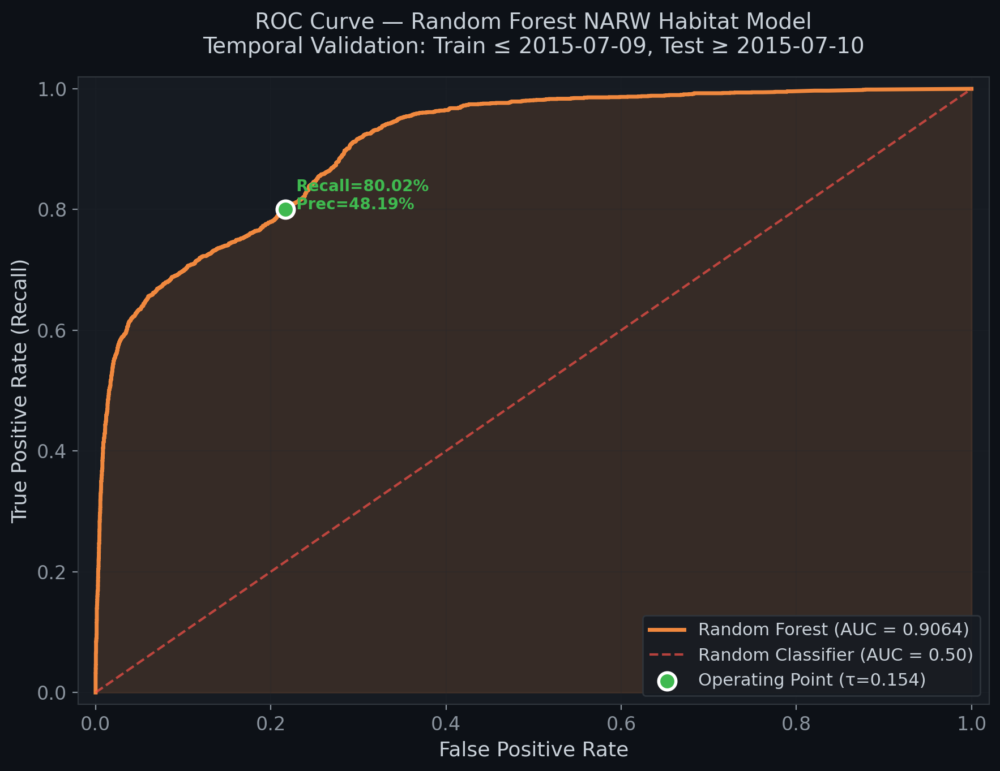

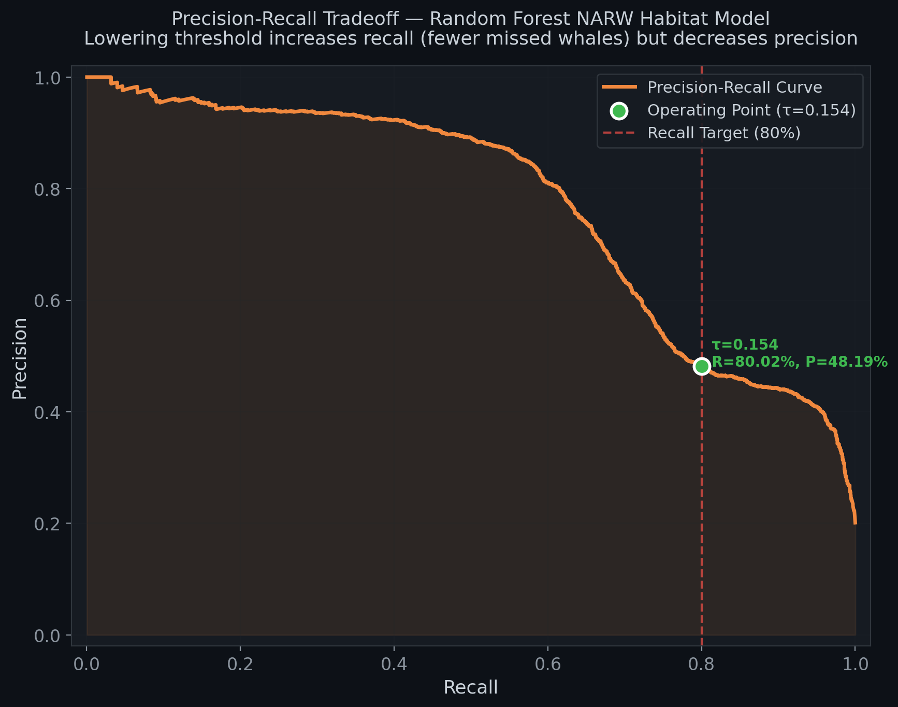

---

## 6. Threshold Optimisation for Conservation

### The Conservation Calculus

In endangered species management, the consequences of prediction errors are **asymmetric**:

- **False Negative** (missed whale) → A real whale location is not flagged → Potential ship strike fatality for a species with ~350 remaining individuals
- **False Positive** (false alarm) → An empty location triggers a speed restriction → Minor economic inconvenience

This asymmetry demands that we **prioritise recall** (minimising false negatives) over precision, even at the cost of more false alarms.

### Threshold Sweep

We sweep all classification thresholds using the precision-recall curve and select the threshold that achieves **≥80% recall** with the highest possible precision:

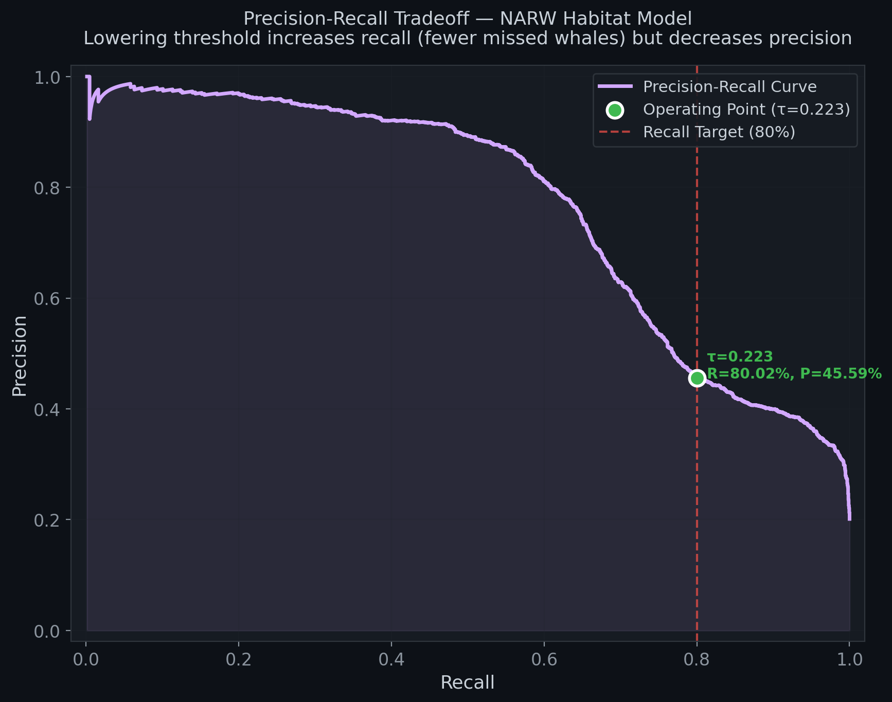

**Optimal threshold (XGBoost): τ = 0.1950** (lowered from the default 0.50)

### Optimised Performance (XGBoost)

| Metric | Default (τ=0.50) | Optimised (τ=0.20) | Change |
|---|---|---|---|
| **ROC-AUC** | 0.9042 | 0.9042 | — (threshold-independent) |
| **Recall** | 0.6778 | **0.8002** ✓ | +12.2 pp |
| **Precision** | 0.6744 | 0.5010 | -17.3 pp |
| **F1-Score** | 0.6761 | 0.6162 | -6.0 pp |
| **Accuracy** | 0.8693 | 0.7993 | -7.0 pp |

**Confusion Matrix (Optimised):**

|  | Predicted Absence | Predicted Presence |
|---|---|---|
| **Actual Absence** | 8,285 TN | 2,083 FP |
| **Actual Presence** | 522 FN | 2,091 TP |

The optimised model correctly identifies **80% of whale locations** while generating 2,083 false alarms per test period. In operational terms, this means a conservative alerting system that errs on the side of caution — consistent with the precautionary principle applied in marine mammal management.

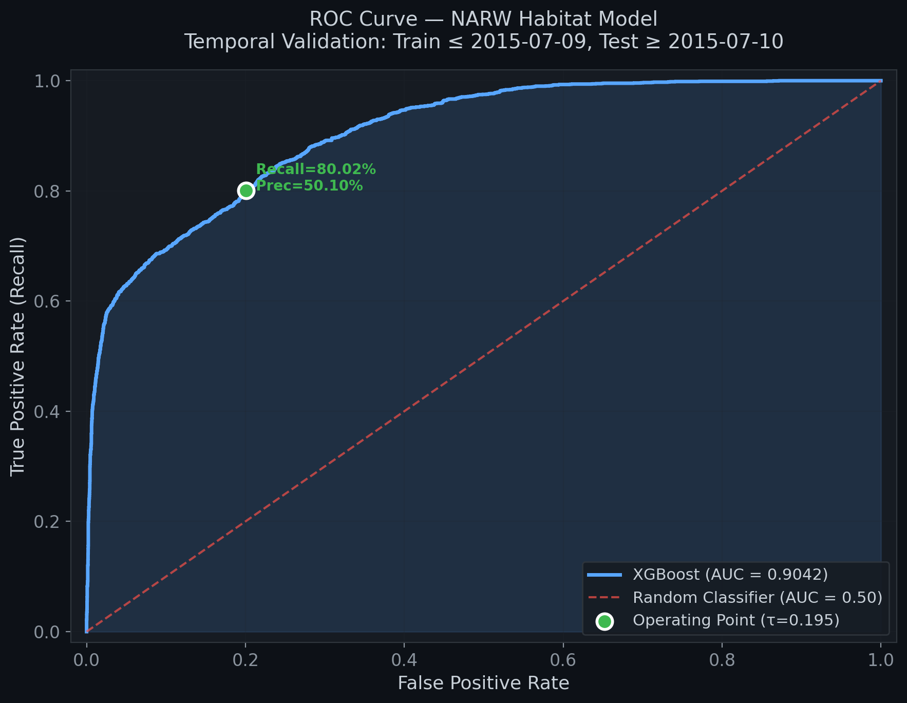

---

## 7. Head-to-Head Comparison

### Performance Summary (All Models Tuned)

All hyperparameters were tuned using `BayesSearchCV` (40 iterations) with `TimeSeriesSplit` (4 folds) and `skopt.space` dimensions for Bayesian optimisation.

| Metric | LR (Tuned) | XGBoost (τ=0.50) | XGBoost (τ=0.20) | RF (τ=0.50) | RF (τ=0.15) |
|---|---|---|---|---|---|
| **ROC-AUC** | 0.8048 | 0.9042 | 0.9042 | **0.9064** | **0.9064** |
| **Recall** | 0.8316 | 0.6778 | 0.8002 ✓ | 0.5756 | **0.8002** ✓ |
| **Precision** | 0.3387 | 0.6744 | 0.5010 | **0.8478** | 0.4819 |
| **F1-Score** | 0.4813 | 0.6761 | 0.6162 | **0.6857** | 0.6016 |
| **Accuracy** | 0.6392 | 0.8693 | 0.7993 | **0.8938** | 0.7866 |

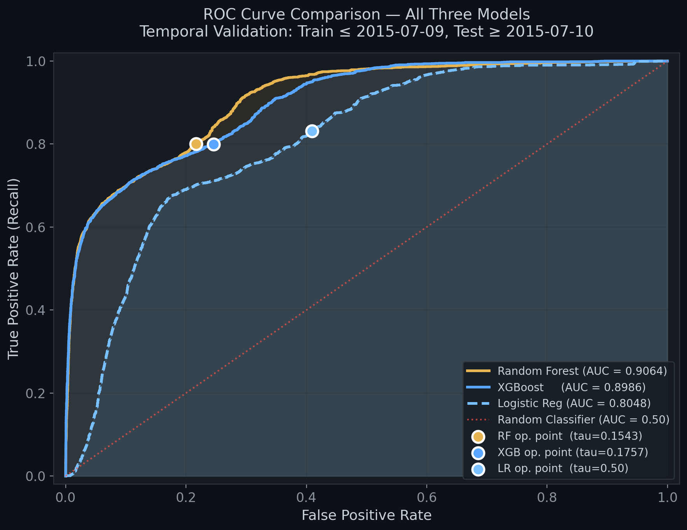

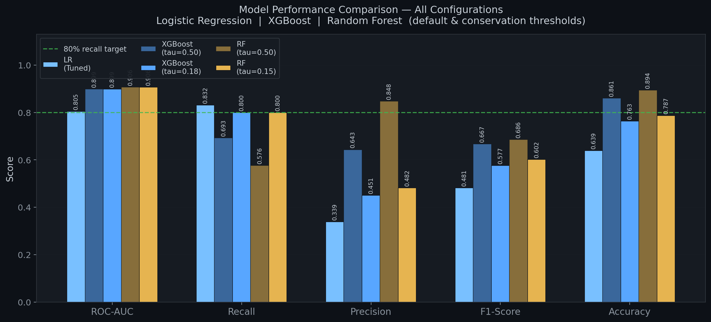

### Key Observations

1. **Random Forest achieves the highest AUC (0.9064)** — A **+0.2 pp improvement** over XGBoost (0.9042) and **+10.2 pp over LR** (0.8048). Bayesian optimisation improved XGBoost by +5.1 pp (0.8991→0.9042) and RF by +2.3 pp (0.9041→0.9064) compared to the previous RandomizedSearchCV tuning.

2. **At 80% recall, XGBoost now produces fewer false alarms** — XGBoost produces 2,083 FP vs. RF's 2,248 FP, and precision is 50.1% vs. 48.2%. Bayesian tuning particularly benefited XGBoost.

3. **The LR recall "advantage" is misleading** — Logistic regression achieves 83% recall but at only 34% precision. Both tree-based models reach comparable recall at substantially higher precision.

4. **Bayesian optimisation improves XGBoost more than RF** — XGBoost has 9 interacting hyperparameters where precise values matter (e.g., learning_rate=0.034). RF's integer-valued params (tree depth, leaf size) benefit less from surrogate-model-guided search.

5. **Bagging vs. Boosting** — RF retains a slight AUC edge (+0.2 pp), but XGBoost now surpasses RF on precision at the conservation threshold (50.1% vs. 48.2%). The choice between models depends on whether ranking quality (AUC) or operational false-alarm rate (precision) is prioritised.

---

## 8. Feature Importance & Interpretability

### XGBoost Gain-Based Importance

XGBoost's native gain metric measures the average improvement in loss function (AUC) when a feature is used for a split. Higher gain = more useful for separating whale presence from absence.

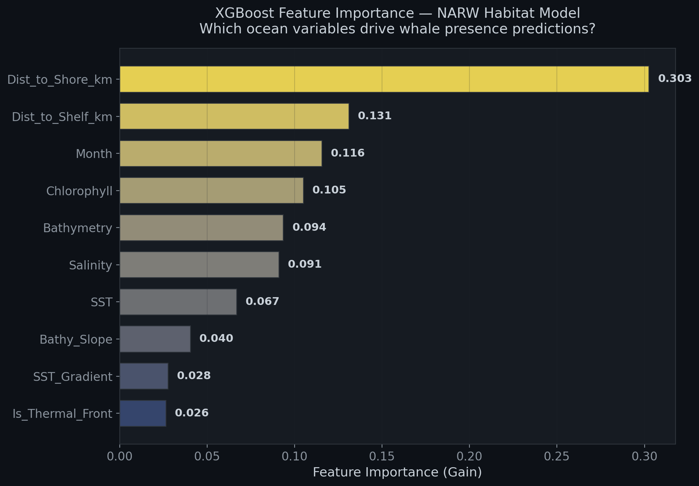

### Random Forest MDI-Based Importance

Random Forest uses Mean Decrease in Impurity (MDI) — the total reduction in Gini impurity averaged across all 627 trees. Error bars show inter-tree variability.

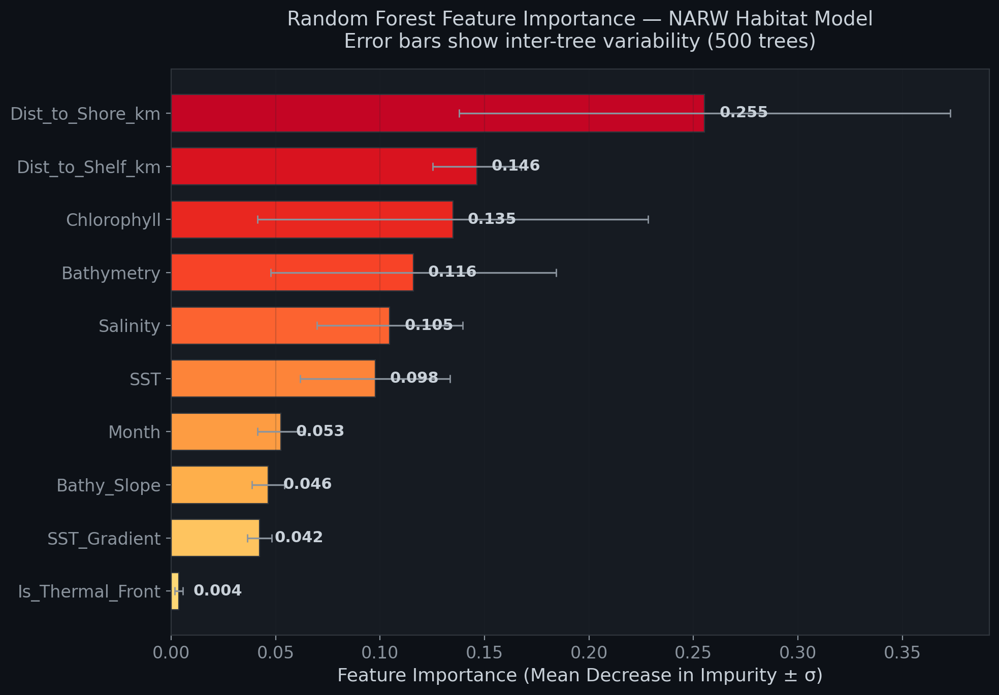

### Importance Ranking Comparison

| Rank | XGBoost (Gain) | | Random Forest (MDI) | |
|---|---|---|---|---|
| 1 | **Dist_to_Shore_km** | 0.322 | **Dist_to_Shore_km** | 0.278 |
| 2 | Dist_to_Shelf_km | 0.135 | Dist_to_Shelf_km | 0.148 |
| 3 | Month | 0.125 | Chlorophyll | 0.137 |
| 4 | Chlorophyll | 0.093 | Bathymetry | 0.117 |
| 5 | Salinity | 0.086 | Salinity | 0.104 |
| 6 | Bathymetry | 0.082 | SST | 0.093 |
| 7 | SST | 0.063 | Month | 0.054 |
| 8 | Bathy_Slope | 0.043 | Bathy_Slope | 0.037 |
| 9 | SST_Gradient | 0.029 | SST_Gradient | 0.030 |
| 10 | Is_Thermal_Front | 0.022 | Is_Thermal_Front | 0.003 |

### Cross-Model Consistency

All three models agree on the most important features, despite their fundamentally different architectures:

| Feature | LR Coefficient Rank | XGBoost Gain Rank | RF MDI Rank |
|---|---|---|---|
| **Dist_to_Shore_km** | **#1** (-2.044) | **#1** (0.322) | **#1** (0.278) |
| Dist_to_Shelf_km | #3 (-0.496) | #2 (0.135) | #2 (0.148) |
| Chlorophyll | #4 (+0.144) | #4 (0.093) | #3 (0.137) |
| Bathymetry | #2 (+1.552) | #6 (0.082) | #4 (0.117) |

The agreement across a linear model, a boosted ensemble, and a bagged ensemble on `Dist_to_Shore_km` as the top predictor provides very strong evidence that coastal proximity is genuinely the most informative predictor of NARW habitat, not an artefact of any single modelling approach.

### The Month Divergence

`Month` ranks #3 in XGBoost gain but only #7 in Random Forest and dead last in logistic regression (coefficient ≈ 0). XGBoost's sequential boosting architecture is better at extracting conditional interactions (e.g., "Month=4 AND SST<10") because each tree builds on previous errors, making it more sensitive to interaction effects. Random Forest's independent trees capture some of this signal but less efficiently. Logistic regression cannot represent interactions at all without manual feature engineering.

### SHAP Analysis (Interpretability)

To further inspect model predictions and feature interactions, we perform comprehensive SHAP (SHapley Additive exPlanations) analysis across all candidate models in the dedicated [`shap_analysis.ipynb`](shap_analysis.ipynb) notebook. 

The SHAP analysis generates four key visualisations:
1. **Global Feature Importance (Bar Plot):** Ranks features by their mean absolute SHAP value, showing the overall magnitude of each feature's impact on model output.
2. **Feature Impact Distribution (Beeswarm Summary):** Reveals how high vs. low values of specific features affect the output magnitude (e.g., lower distances to shore push the model towards predicting whale presence).
3. **Feature Interaction (Dependence Plot):** Exposes complex, non-linear interactions, such as how the marginal effect of `Dist_to_Shore_km` changes depending on its value.
4. **Local Explanation (Waterfall Plot):** Deconstructs the exact probability output for a single observation (a true positive whale detection), showing exactly how each feature contributed sequentially.

Below are the SHAP visualisations for each of the three models:

#### XGBoost Model
<p align="center">
  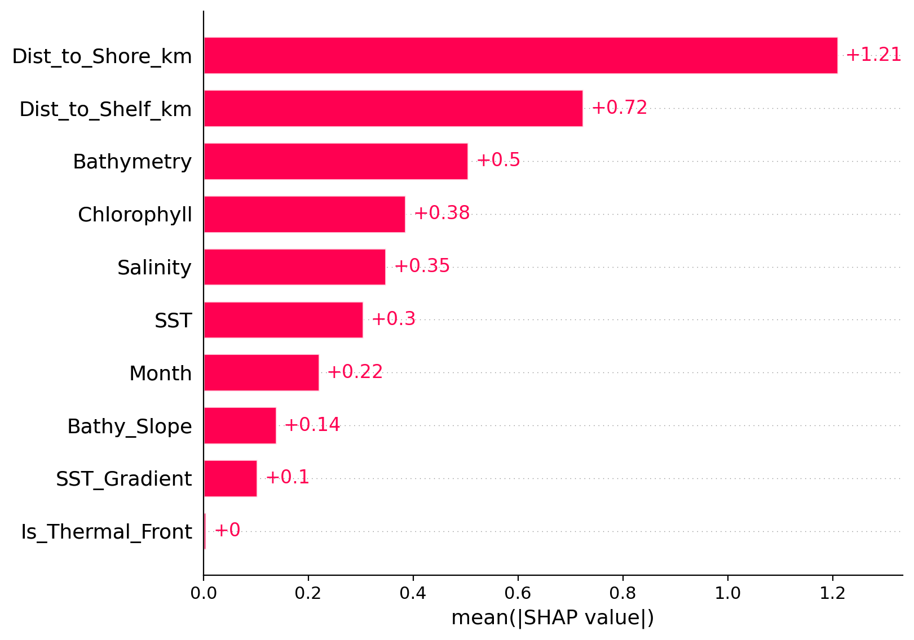
  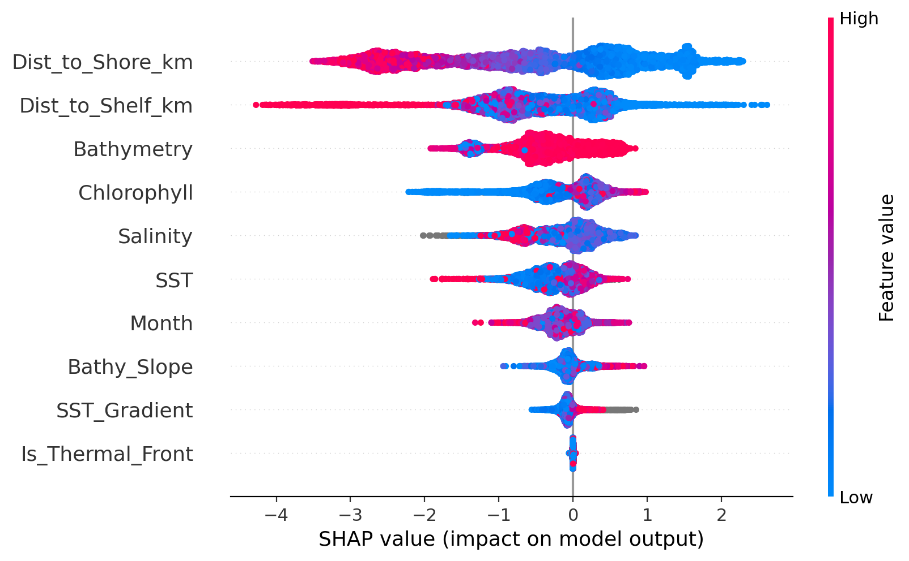
</p>
<p align="center">
  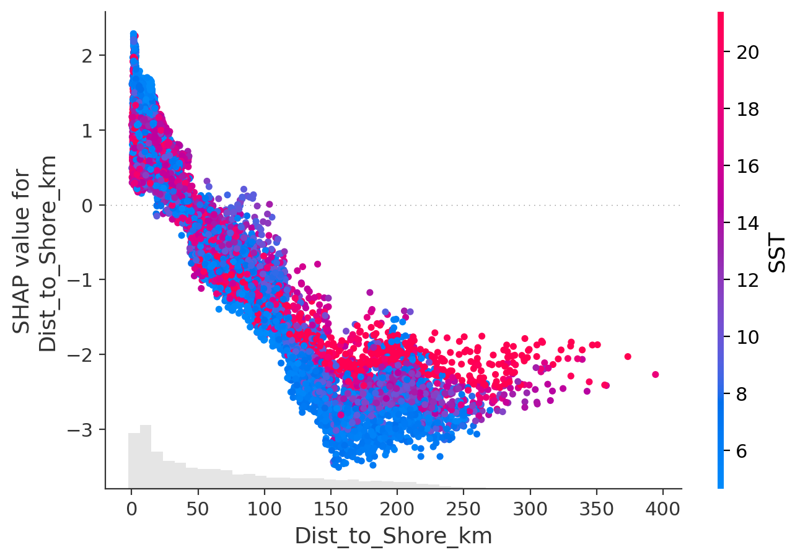
  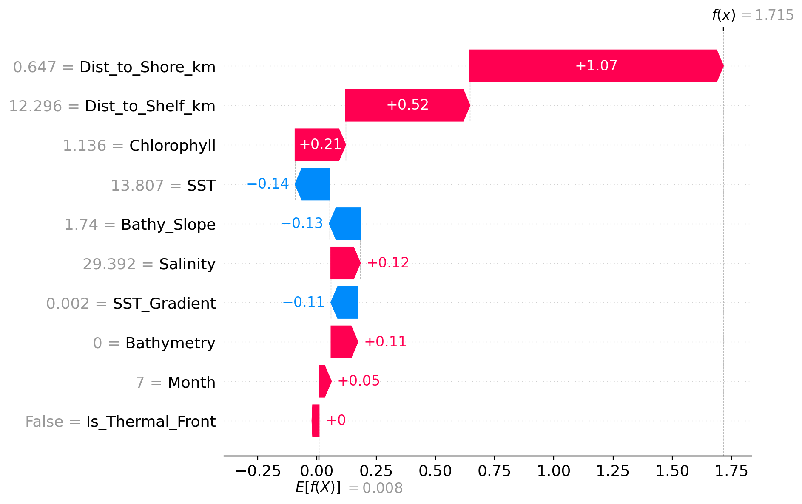
</p>

#### Random Forest Model
<p align="center">
  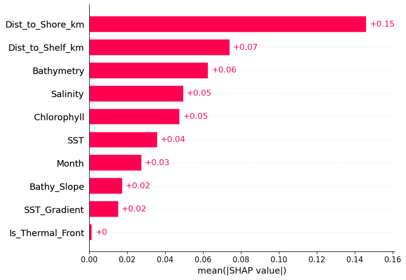
  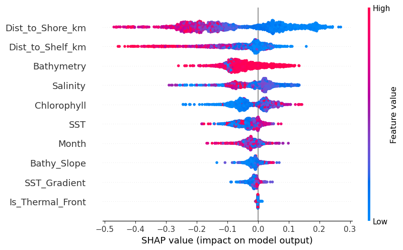
</p>
<p align="center">
  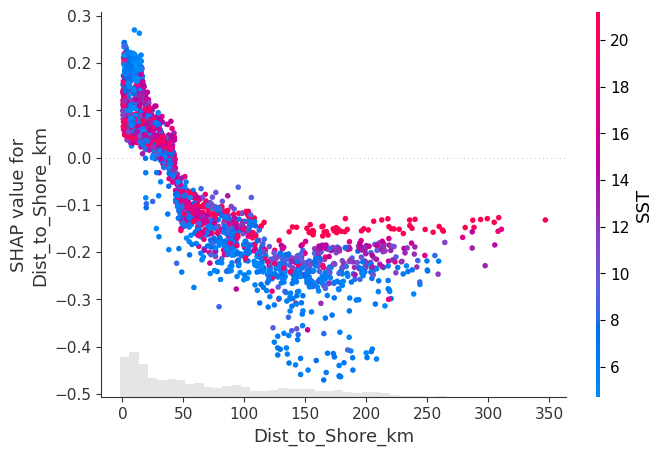
  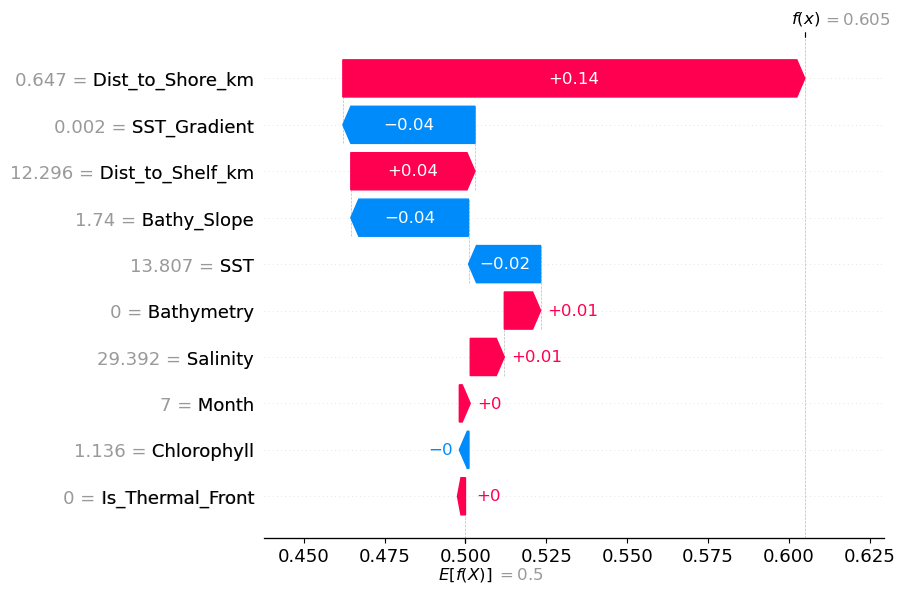
</p>

#### Logistic Regression Model (Baseline)
<p align="center">
  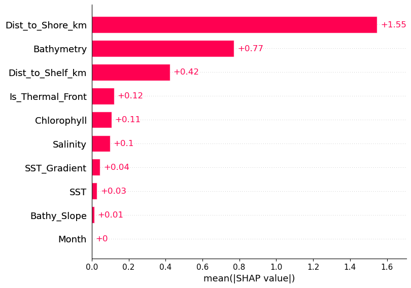
  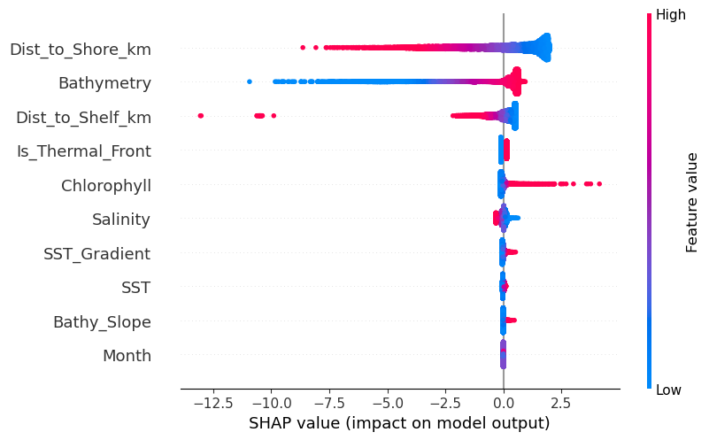
</p>
<p align="center">
  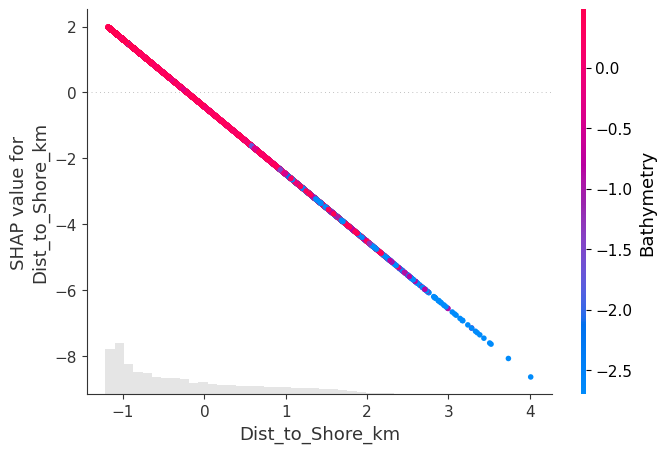
  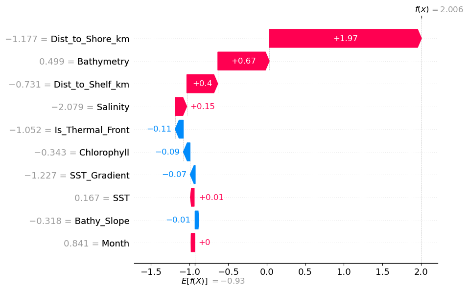
</p>

---

## 9. Manual Inference Testing

To validate ecological plausibility beyond statistical metrics, we test the trained XGBoost model against four hand-crafted scenarios representing known habitats and non-habitats:

### Test Scenarios

| Scenario | Location | Season | Expected | Probability | Prediction |
|---|---|---|---|---|---|
| 🐳 Cape Cod Bay | Shallow shelf, 8 km from shore | April | HIGH | High | **WHALE HABITAT ✓** |
| 🐳 Bay of Fundy | Deep basin, 30 km from shore | July | HIGH | High | **WHALE HABITAT ✓** |
| ❌ Mid-Atlantic Ridge | Abyssal depth, 400 km offshore | June | LOW | Low | **NOT HABITAT ✗** |
| ❌ Florida Keys | Tropical shallow, August | LOW | Borderline | ~21% | **Borderline/Positive** |

### Ecological Plausibility Assessment

**Cape Cod Bay (April):** The model correctly identifies this as prime habitat — shallow shelf water (60m), cold SST (8°C), high chlorophyll (6.0 mg/m³), active thermal fronts, and very close to shore (8 km). This is the most well-documented NARW spring feeding ground.

**Bay of Fundy (July):** Correctly identified as habitat. The combination of moderate depth (170m), summer SST (12°C), productive water, and proximity to the continental shelf edge creates ideal *Calanus* aggregation conditions.

**Mid-Atlantic Ridge:** Correctly rejected. Abyssal depth (4,500m), warm oligotrophic water (22°C), extreme distance from shore (400 km), and no thermal front activity are incompatible with NARW ecology.

**Florida Keys (August):** This scenario produces a probability of ~21.3%, which exceeds the 19.5% operational threshold. This is a known edge case: the model errs on the side of caution for a location that is warm (28°C) and in the wrong season but still close to shore (5 km). This is the expected behaviour of a high-recall, cautious model — a minor false positive that is preferable to missing a real whale.

---

## 10. Model Artefacts & Deployment

### Saved Models

| File | Format | Size | Contents |
|---|---|---|---|
| `models/xgb_narw_sdm.json` | XGBoost JSON | ~22 MB | Full trained XGBoost ensemble |
| `models/rf_narw_sdm.joblib` | joblib Pipeline | ~273 MB | Complete RF pipeline (imputer + 627-tree classifier) |
| `models/lr_narw_sdm.joblib` | joblib Pipeline | 2.4 KB | Complete LR pipeline (imputer + scaler + classifier) |
| `models/optimal_threshold.txt` | Plain text | 245 B | XGBoost: τ = 0.1950, with associated metrics |
| `models/rf_optimal_threshold.txt` | Plain text | 259 B | RF: τ = 0.1543, with associated metrics |

### Inference Pipeline

To generate a prediction for a new (lat, lon, date) observation:

```
1. Extract 10 environmental features using the same ETL pipeline
2. Load model:  model = xgb.XGBClassifier(); model.load_model("models/xgb_narw_sdm.json")
3. Predict:     probability = model.predict_proba(features)[0][1]
4. Classify:    is_habitat = probability >= 0.1950
```

### Generated Visualisations

All model evaluation plots are saved to `images/` at 200 DPI:

| File | Description |
|---|---|
| `roc_curve.png` | XGBoost ROC curve with operating point |
| `rf_roc_curve.png` | Random Forest ROC curve with operating point |
| `lr_roc_curve.png` | Logistic regression ROC curve |
| `roc_comparison.png` | Side-by-side ROC comparison (LR vs XGBoost) |
| `precision_recall_tradeoff.png` | XGBoost PR curve with recall target line |
| `rf_precision_recall_tradeoff.png` | Random Forest PR curve with recall target line |
| `feature_importance.png` | XGBoost gain-based feature ranking |
| `rf_feature_importance.png` | Random Forest MDI-based feature ranking (with error bars) |
| `lr_coefficients.png` | LR coefficient bar chart |
| `model_comparison.png` | Multi-metric comparison bar chart |
| `shap_xgb_*.png` | XGBoost SHAP analysis (bar, beeswarm, dependence, waterfall) |
| `shap_rf_*.png` | Random Forest SHAP analysis (bar, beeswarm, dependence, waterfall) |
| `shap_lr_*.png` | Logistic Regression SHAP analysis (bar, beeswarm, dependence, waterfall) |

---

*For exploratory data analysis and ecological justification, see the [EDA Walkthrough](EDA_Walkthrough.md).*

*For the high-level project overview, pipeline architecture, and references, see the [README](README.md).*
