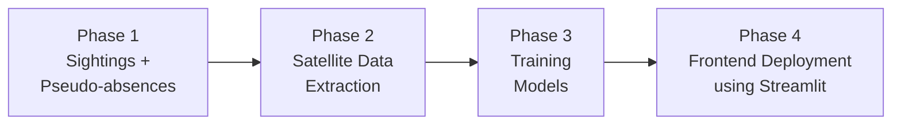
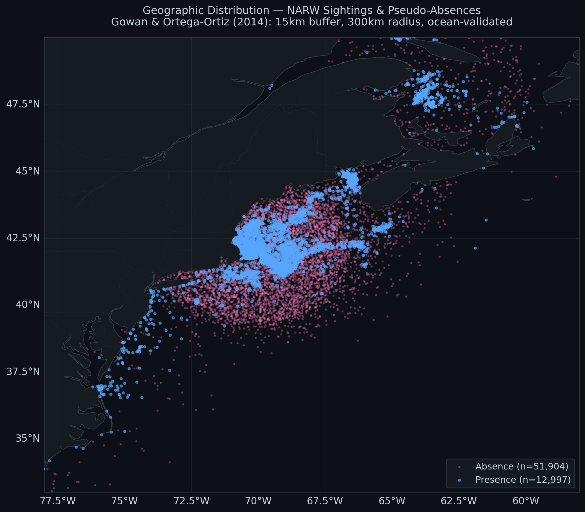
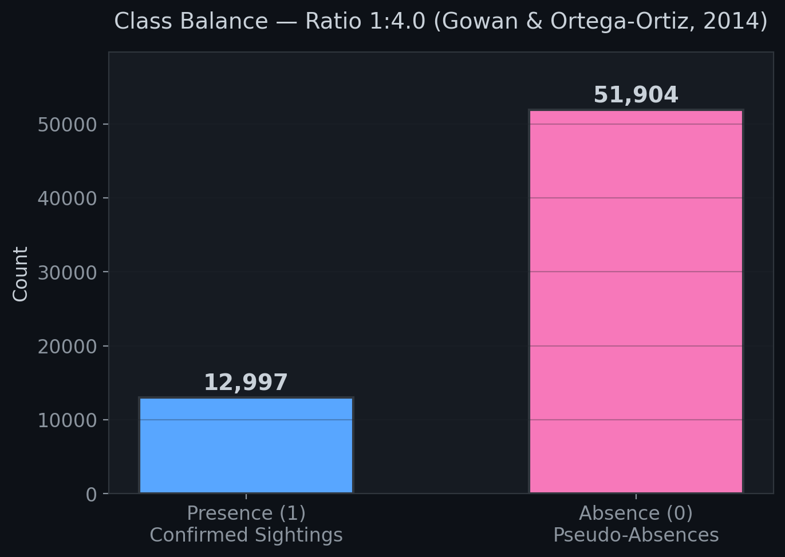
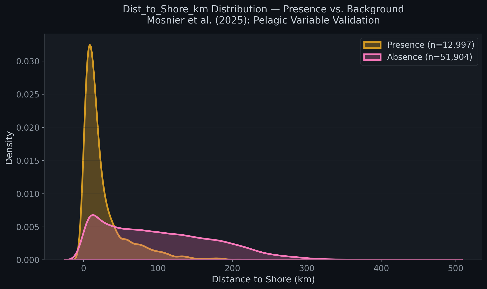
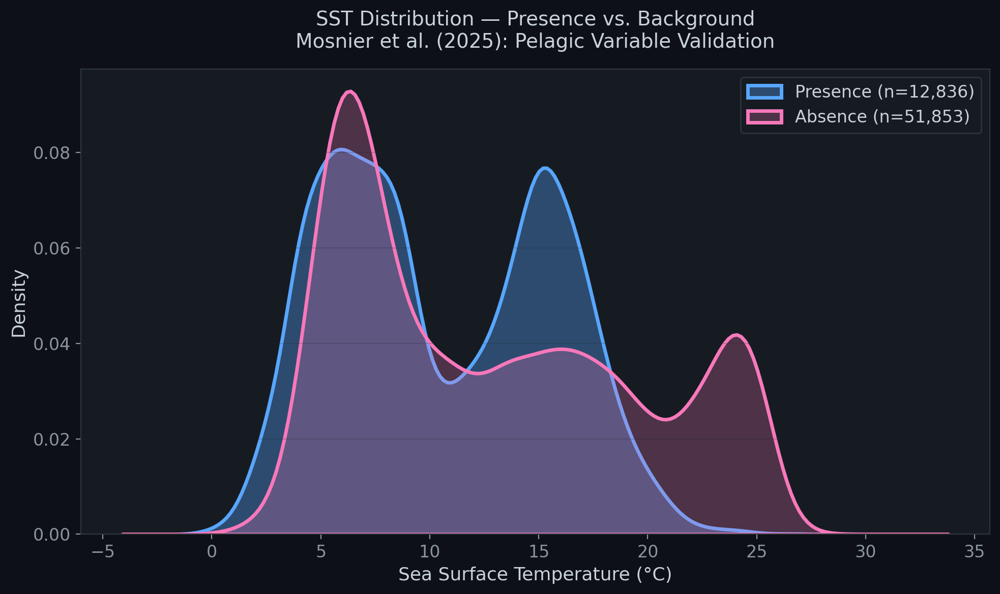
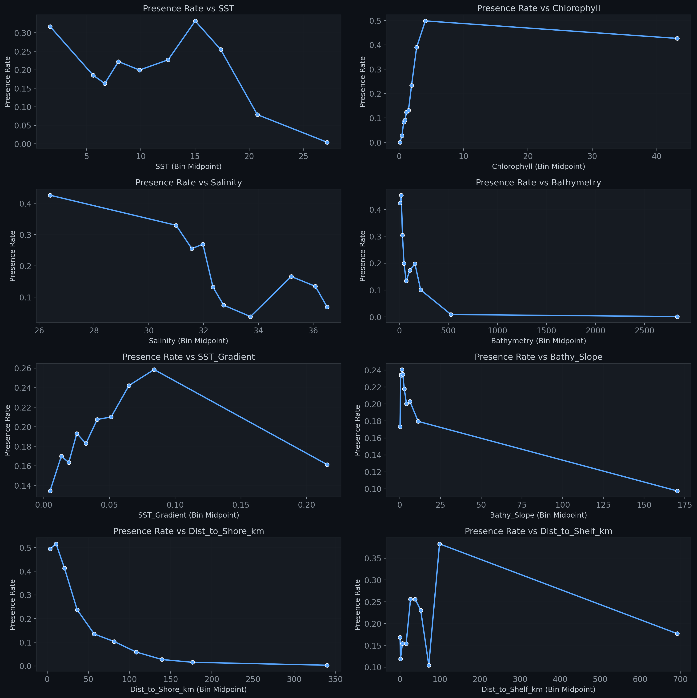

# WhaleGuard — NARW Species Distribution Model

**Official repository for Project WhaleGuard by team Neural Network Navigators for RBC Borealis Let's SOLVE It Undergraduate Mentorship Program, Spring 2026 cohort.**

A production-grade machine learning pipeline for predicting North Atlantic Right Whale (*Eubalaena glacialis*) habitat suitability using satellite-derived oceanographic data and ensemble tree classifiers.

## The Problem
Current solutions are primarily reactive, utilizing acoustic buoys or satellite detection to flag whales only after they have entered a shipping lane. These systems often force vessels to brake suddenly, which disrupts supply chains. Furthermore, enterprise-grade systems are often too expensive for smaller vessels, such as fishing and lobster boats, leaving them without AI-enabled protection.

## Our Solution
WhaleGuard shifts maritime safety from a reactive model to a predictive forecasting system. The platform predicts whale habitat based on satellite-derived ocean conditions to enable proactive vessel rerouting and speed restrictions before collisions occur.

---

## Documentation

This project is documented across three complementary files:

| Document | Description |
|---|---|
| **[README.md](README.md)** (this file) | High-level overview: pipeline architecture, data sources, feature dictionary, and results summary |
| **[EDA_Walkthrough.md](EDA_Walkthrough.md)** | In-depth technical walkthrough of exploratory data analysis, statistical tests, and ecological validation |
| **[ML_Walkthrough.md](ML_Walkthrough.md)** | In-depth technical walkthrough of model training, threshold optimisation, and evaluation |

An **interactive Streamlit dashboard** (`dashboard.py`) is also included for live habitat probability queries and Gulf of St. Lawrence heatmap visualisation.

---

## Table of Contents

1. [Project Overview](#project-overview)
2. [Pipeline Architecture (4 Phases)](#pipeline-architecture-4-phases)
3. [Data Sources & Provenance](#data-sources--provenance)
4. [Feature Dictionary (All 10 Features)](#feature-dictionary-all-10-features)
5. [Results Summary](#results-summary)
6. [File Structure](#file-structure)
7. [Known Issues & Edge Cases](#known-issues--edge-cases)
8. [Future Work](#future-work)
9. [References](#references)

---

## Project Overview

North Atlantic Right Whales are among the most endangered large whales on Earth (~380 individuals remaining, including only ~70 breeding females). Ship strikes and fishing gear entanglement are the primary causes of mortality. This project builds a **predictive habitat model** that can identify where whales are likely to be, enabling proactive management decisions (speed restrictions, route changes).

**Core question:** *Given oceanographic conditions at a location on a given day, what is the probability that a NARW is present?*

**Model performance (all models tuned via `BayesSearchCV` + `skopt.space` dimensions):**
- **ROC-AUC: 0.9064** (Random Forest) / **0.8986** (XGBoost) — strong discriminative power
- **Recall: ≥80%** at conservation-optimised thresholds (RF τ = 0.15, XGBoost τ = 0.20)
- Trained on 51,920 rows, tested on 12,981 rows (temporal split)
- **Two-stage optimisation:** hyperparameter tuning maximises ROC-AUC (ranking quality), then threshold optimisation achieves ≥80% recall (conservation constraint)

> For the complete model comparison, hyperparameter tuning details, and threshold optimisation rationale, see the [ML Walkthrough](ML_Walkthrough.md).

---

## Pipeline Architecture (4 Phases)

The project is built in 4 sequential phases:



### Phase 1 — Sighting Data + Pseudo-Absence Generation

**Script:** `pipeline.py` (lines 1-400)

**Input:** `data/raw/23305_RWSAS.csv` — NOAA Right Whale Sighting Advisory System database

**What it does:**
1. Loads confirmed NARW sighting records (lat, lon, date)
2. For each sighting, generates **4 pseudo-absence points** using the **Gowan & Ortega-Ortiz (2014)** methodology:
   - **Temporal matching:** Same day as the real sighting
   - **Spatial buffering:** Random location between 15 km (inner buffer) and 300 km (outer buffer) from the sighting
   - **Ocean-only constraint:** Rejects any point that falls on land (using `global-land-mask`)
3. Labels sightings as `Presence=1` and pseudo-absences as `Presence=0`

**Output:** A balanced dataset with a 1:4 presence-to-absence ratio.

**Why 1:4?** Gowan (2014) showed this ratio optimally balances model sensitivity while reflecting the reality that most of the ocean is NOT whale habitat at any given time.

> For the statistical validation of this design choice, see [EDA Walkthrough — Class Balance & Pseudo-Absence Design](EDA_Walkthrough.md#3-class-balance--pseudo-absence-design).

---

### Phase 2 — Satellite Data Extraction

**Scripts:** `pipeline.py`, `phase3_feature_engineering.py`, and spatial feature engineering scripts

**What it does:** Maps 10 ocean variables to every data point using a custom high-speed slab-fetch pipeline. Instead of making one HTTP request per data point (~65,000 requests), the engine groups points by date, downloads a single spatial "slab" covering all points for that day, and extracts values locally. This reduces network calls by ~100×.

**Smart interpolation:**
- **Nearest Neighbor** — high-resolution grids (1 km SST, Bathymetry) to preserve sharpness
- **Bilinear Blending** — low-resolution grids (Salinity, Chlorophyll) for continuous gradients

**Variables extracted and engineered:**
- **SST** — MUR SST (JPL, 0.01° daily)
- **Chlorophyll** — MODIS Aqua R2022 Science Quality (NASA, 4 km monthly, gap-filled to 99.3% coverage)
- **Salinity** — SMAP (JPL, 0.25° daily)
- **Bathymetry** — ETOPO1 (NOAA, 1 arc-min, static)
- **SST_Gradient** — spatial gradient magnitude (°C/km), computed via `np.gradient` with cosine correction
- **Is_Thermal_Front** — Boolean flag where SST_Gradient > 0.035 °C/km (Tao et al., 2025)
- **Bathy_Slope** — bathymetric gradient (m/km) via `np.gradient` on ETOPO1
- **Dist_to_Shore_km** — nearest coastline distance via `scipy.spatial.cKDTree`
- **Dist_to_Shelf_km** — distance to 200m isobath (shelf break) via KDTree

**Output:** `data/processed/ML_Whale_Dataset_Final.csv` (64,901 rows × 14 columns)

---

## Data Sources & Provenance

| Variable | Dataset | Source | Resolution | Type |
|---|---|---|---|---|
| Sightings | RWSAS (ID: 23305) | NOAA | Point data | Dynamic |
| SST | MUR SST v4.1 | JPL/NASA | 0.01° daily | Dynamic |
| Chlorophyll | MODIS Aqua R2022 SQ | NASA | 4 km monthly | Dynamic |
| Salinity | SMAP SSS v5.0 | JPL/NASA | 0.25° daily | Dynamic |
| Bathymetry | ETOPO1 | NOAA NCEI | 1 arc-min | Static |

All data accessed via **OPeNDAP/ERDDAP** (no manual downloads).

---

## Feature Dictionary (All 10 Features)

The model trains on **10 features**. Here is what each one captures ecologically:

### Dynamic Features (change with time)

#### 1. `SST` — Sea Surface Temperature (°C)
- **Source:** MUR SST 0.01° daily
- **Range in data:** -1.8 to 31.5 °C
- **Mann-Whitney |r|:** 0.179 (p ≈ 10⁻²¹⁶)
- **Ecological role:** SST controls copepod (prey) development and distribution. NARWs prefer 6-14°C waters where *Calanus finmarchicus* aggregates. The model's presence mean (10.6°C) vs. absence mean (12.9°C) confirms this cold-water preference.

#### 2. `Chlorophyll` — Chlorophyll-a Concentration (mg/m³)
- **Source:** MODIS Aqua R2022 Science Quality (monthly)
- **Range in data:** 0.04 to 81.4 mg/m³
- **Mann-Whitney |r|:** **0.570** (p ≈ 0) — 2nd strongest
- **Ecological role:** Proxy for primary productivity (phytoplankton). High Chl-a indicates productive waters where the food web supports copepod blooms. Presence mean (3.5 mg/m³) is nearly 2× the absence mean (1.9 mg/m³).

#### 3. `Salinity` — Sea Surface Salinity (PSU)
- **Source:** SMAP SSS 0.25° daily
- **Range in data:** 0.06 to 38.2 PSU
- **Mann-Whitney |r|:** 0.377 (p ≈ 0)
- **Ecological role:** Salinity marks water mass boundaries. NARWs prefer slightly fresher shelf waters (presence mean: 32.2 PSU) over saltier open-ocean water (absence mean: 33.3 PSU). 

#### 4. `SST_Gradient` — Spatial SST Gradient Magnitude (°C/km)
- **Source:** Derived from MUR SST via Sobel gradient
- **Range in data:** 0.0 to 4.5 °C/km
- **Mann-Whitney |r|:** 0.085 (p ≈ 10⁻⁴⁹)
- **Ecological role:** Measures the "sharpness" of temperature boundaries. Strong gradients indicate oceanographic fronts where different water masses meet, creating convergence zones that aggregate prey.

#### 5. `Is_Thermal_Front` — Boolean Thermal Front Flag
- **Source:** Derived: `SST_Gradient > 0.035 °C/km`
- **Threshold:** 0.035 °C/km (Tao et al., 2025)
- **Mann-Whitney |r|:** 0.047 (p ≈ 10⁻²¹)
- **Ecological role:** Binary flag for active thermal fronts. 54% of whale sightings occur at fronts vs. 49% of absences — a small but statistically significant difference.

#### 6. `Month` — Calendar Month (1-12)
- **Source:** Extracted from sighting date
- **Mann-Whitney |r|:** 0.001 (**NOT significant**, p = 0.80)
- **XGBoost Gain Rank:** **#3** (0.125 gain)
- **Ecological role:** Captures seasonal migration patterns (calving in winter SE US, feeding in summer NE US).
> **Note:** Month appears "weak" in univariate tests but is highly important in XGBoost. This is because pseudo-absences share the same month as sightings, neutralizing univariate correlation. However, XGBoost captures interactions like "Month=4 AND SST<10" which hold high predictive power. See [EDA Walkthrough — The Month Paradox](EDA_Walkthrough.md#10-mann-whitney-u-tests--statistical-significance) for the full analysis.

### Static Features (don't change with time)

#### 7. `Bathymetry` — Ocean Depth (meters)
- **Source:** ETOPO1, 1 arc-minute
- **Range in data:** -4863 to +125 m
- **Mann-Whitney |r|:** **0.496** (p ≈ 0) — 3rd strongest
- **Ecological role:** NARWs are a continental shelf species. Presence mean: -58m (shallow shelf). Absence mean: -374m (deeper slope/basin).

#### 8. `Bathy_Slope` — Bathymetric Gradient (m/km)
- **Source:** Derived from ETOPO1 via `np.gradient`
- **Range in data:** 0.0 to 325.5 m/km
- **Mann-Whitney |r|:** 0.082 (p ≈ 10⁻⁴⁷)
- **Ecological role:** Marks the continental shelf break. Whales prefer **flat** areas (presence mean: 3.9 m/km) over steep slopes (absence mean: 7.9 m/km).

#### 9. `Dist_to_Shore_km` — Distance to Nearest Coastline (km)
- **Source:** Derived from ETOPO1 land mask
- **Range in data:** 0.0 to 483.1 km
- **Mann-Whitney |r|:** **0.656** (p ≈ 0) — **STRONGEST of all features**
- **Ecological role:** NARWs are strongly coastal. Presence mean: **26 km** from shore. Absence mean: **102 km**.

#### 10. `Dist_to_Shelf_km` — Distance to 200m Isobath (km)
- **Source:** Derived from ETOPO1 200m contour
- **Range in data:** 0.0 to 1271.8 km
- **Mann-Whitney |r|:** 0.116 (p ≈ 10⁻⁹²)
- **Ecological role:** The 200m isobath marks the shelf break, an upwelling zone for prey. Whales are found near but not directly on the shelf break.

---

## Results Summary

### EDA Highlights

<p align="center">
  
  
</p>

<p align="center">
  
  
</p>

<p align="center">
  
</p>

> For the full analysis of all 27 visualisations, statistical tests, and ecological interpretations, see the [EDA Walkthrough](EDA_Walkthrough.md).

### Model Performance (Tuned via `BayesSearchCV` + `skopt.space` Dimensions)

| Metric | Logistic Regression | XGBoost (τ=0.50) | XGBoost (τ=0.20) | Random Forest (τ=0.50) | Random Forest (τ=0.15) |
|---|---|---|---|---|---|
| **ROC-AUC** | 0.8048 | 0.8986 | 0.8986 | **0.9064** | **0.9064** |
| Recall | 0.8316 | 0.6927 | 0.8002 ✓ | 0.5756 | **0.8002** ✓ |
| Precision | 0.3387 | 0.6430 | 0.501 | **0.8478** | 0.482 |
| F1-Score | 0.4814 | 0.6669 | 0.616 | **0.6857** | 0.602 |
| Accuracy | 0.6393 | 0.8607 | 0.7633 | **0.8938** | 0.7866 |

<p align="center">
  
  
</p>

<p align="center">
  
</p>

> For the complete model comparison, threshold optimisation, and interpretability analysis, see the [ML Walkthrough](ML_Walkthrough.md).

---

## File Structure

```
WhaleGuard_RBC_LSI/
├── data/
│   ├── raw/
│   │   └── 23305_RWSAS.csv                        # Raw NOAA sightings
│   └── processed/
│       ├── ML_Whale_Dataset_Base.csv               # Phase 2 output (4 env vars)
│       ├── ML_Whale_Dataset_Engineered.csv         # Phase 3 (+ SST gradient)
│       ├── ML_Whale_Dataset_Engineered_Patched.csv # Phase 3.5 (+ Chl-a fix)
│       ├── ML_Whale_Dataset_Final.csv              # Phase 5 (+ 3 spatial features) ← TRAINING DATA
│       └── Gulf_St_Lawrence_Grid_Features.csv      # Gulf grid predictions (2002–2026)
├── models/
│   ├── xgb_narw_sdm.json                          # Trained XGBoost model
│   ├── rf_narw_sdm.joblib                         # Trained Random Forest model (best)
│   ├── lr_narw_sdm.joblib                         # Trained LR baseline model
│   ├── optimal_threshold.txt                       # XGBoost: τ = 0.20 for ≥80% recall
│   └── rf_optimal_threshold.txt                    # RF: τ = 0.15 for ≥80% recall
├── images/                                         # 35 publication-ready plots
├── pipeline.py                                     # Phase 1-2: ETL + pseudo-absences
├── phase3_feature_engineering.py                   # Phase 3: SST gradient + thermal fronts
├── generate_gulf_grid.py                           # Gulf of St. Lawrence grid generation
├── train_logistic_regression.py                    # LR baseline model
├── train_xgboost.py                               # XGBoost model + threshold opt.
├── train_random_forest.py                          # Random Forest model + threshold opt.
├── manual_test.py                                  # Inference test with 4 scenarios
├── eda_narw_sdm.ipynb                             # Main EDA notebook (27 visualisations)
├── eda_phase5.py                                   # Phase 5 EDA: spatial feature analysis
├── shap_analysis.ipynb                             # SHAP interpretability analysis
├── dashboard.py                                    # Streamlit habitat prediction dashboard
├── requirements.txt                                # Python dependencies
├── README.md                                       # Project overview (this file)
├── EDA_Walkthrough.md                             # Technical EDA documentation
└── ML_Walkthrough.md                              # Technical ML documentation
```

---

## Known Issues & Edge Cases

1. **November 2017 Presence Rate Anomaly:** 22 sightings in the Gulf of St. Lawrence have positive longitudes instead of negative. Acceptable as-is, but can be fixed in Phase 1 re-runs.
2. **Chlorophyll NaNs (0.7%):** Gap-filled MODIS product doesn't cover extreme dates/locations. Handled natively by XGBoost; median-imputed for RF and LR.
3. **Salinity NaNs (4.4%):** SMAP satellite has lower resolution and reduced coastal coverage. Handled natively by XGBoost; median-imputed for RF and LR.
4. **Manual Test False Positive:** Florida Keys in August gives a 21.3% probability, which exceeds the 20% XGBoost threshold. This is expected from a high-recall, cautious model.

---

## Interpretability (SHAP)

We used SHAP (SHapley Additive exPlanations) to deeply analyze feature impacts across all three models. By utilizing game-theoretic credit allocation, the SHAP analysis (`shap_analysis.ipynb`) produces beeswarm summary plots, global importance bar charts, dependence plots, and local waterfall explanations for specific whale sightings. This provides transparency into exactly how features like `Dist_to_Shore_km` drive predictions.

---

## Dashboard

`dashboard.py` is a Streamlit web application that serves the trained models interactively. It loads the Gulf of St. Lawrence grid (`Gulf_St_Lawrence_Grid_Features.csv`) and renders monthly habitat probability heatmaps across 2002–2026. Users can step through time to observe how whale habitat shifts with changing ocean conditions.

To launch:
```bash
streamlit run dashboard.py
```

---

## Future Work

1. **Real-Time ERDDAP Forecasting:** Automate environmental data pull for T+72h predictions using near-realtime NOAA feeds, enabling true operational forecasting.
2. **Vessel Alert API:** REST endpoint that cross-references ship AIS tracks with high-probability whale zones and issues speed-restriction advisories.
3. **Extended Coverage:** Expand the spatial grid beyond the Gulf of St. Lawrence to cover the full Northwest Atlantic shelf (Cape Hatteras to the Scotian Shelf).
4. **Temporal Forecasting:** Integrate ocean model forecasts (e.g., HYCOM) to project habitat suitability 72h into the future, not just hindcast.

---

## References

1. **Baumgartner, M. F. & Mate, B. R. (2005).** Summer and fall habitat of North Atlantic right whales inferred from satellite telemetry. *Can. J. Fish. Aquat. Sci.*, 62(3), 527-543.
2. **Gowan, T. A. & Ortega-Ortiz, J. G. (2014).** Wintering habitat model for the NARW in the southeastern US. *Endangered Species Research*, 23(3), 291-302.
3. **Ji, R., et al. (2024).** Machine learning approaches for North Atlantic right whale habitat prediction. *Marine Ecology Progress Series*.
4. **Pendleton, D. E., et al. (2012).** Weekly predictions of NARW habitat reveal influence of prey abundance and seasonality. *Endangered Species Research*, 18(2), 147-161.
5. **Roberts, J. J., et al. (2016).** Habitat-based cetacean density models for the U.S. Atlantic and Gulf of Mexico. *Scientific Reports*, 6, 22615.
6. **Ross, C. H., et al. (2025).** Energy-based prey thresholds improve NARW habitat predictions. *Endangered Species Research*.
7. **Schick, R. S., et al. (2009).** Striking the right balance in right whale conservation. *Can. J. Fish. Aquat. Sci.*, 66(9), 1399-1403.
8. **Tao, Y., et al. (2025).** Multi-sensor NARW habitat model with thermal front detection.
9. **Wyles, J. D., et al. (2022).** Seabed geomorphology as a predictor of habitat use in marine predators. *Frontiers in Marine Science*, 9, 818635.
