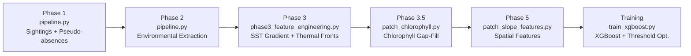

# WhaleGuard — NARW Species Distribution Model

**Complete Project Documentation**

A production-grade machine learning pipeline for predicting North Atlantic Right Whale (*Eubalaena glacialis*) habitat suitability using satellite-derived oceanographic data and an XGBoost classifier.

---

## Table of Contents

1. [Project Overview](#project-overview)
2. [Pipeline Architecture (5 Phases)](#pipeline-architecture-5-phases)
3. [Data Sources & Provenance](#data-sources--provenance)
4. [Feature Dictionary (All 10 Features)](#feature-dictionary-all-10-features)
5. [Exploratory Data Analysis (EDA) & Visualisations](#exploratory-data-analysis-eda--visualisations)
6. [Model Training Methodology](#model-training-methodology)
7. [Evaluation Results](#evaluation-results)
8. [File Structure](#file-structure)
9. [Known Issues & Edge Cases](#known-issues--edge-cases)
10. [Future Work](#future-work)
11. [References](#references)

---

## Project Overview

North Atlantic Right Whales are among the most endangered large whales on Earth (~350 individuals remaining). Ship strikes and fishing gear entanglement are the primary causes of mortality. This project builds a **predictive habitat model** that can identify where whales are likely to be, enabling proactive management decisions (speed restrictions, route changes).

**Core question:** *Given oceanographic conditions at a location on a given day, what is the probability that a NARW is present?*

**Model performance:**
- **ROC-AUC: 0.8805** (strong discriminative power)
- **Recall: 80.0%** at optimised threshold (τ = 0.1718)
- Trained on 51,920 rows, tested on 12,981 rows (temporal split)

---

## Pipeline Architecture (5 Phases)

The project is built in 5 sequential phases, each with its own script:



### Phase 1 — Sighting Data + Pseudo-Absence Generation

**Script:** `pipeline.py` (lines 1-400)

**Input:** `data/raw/23305_RWSAS.csv` — NOAA Right Whale Sighting Advisory System database

**What it does:**
1. Loads confirmed NARW sighting records (lat, lon, date)
2. For each sighting, generates **4 pseudo-absence points** using the **Gowan & Ortega-Ortiz (2014)** methodology:
   - **Temporal matching:** Same day as the real sighting
   - **Spatial buffering:** Random location between 15 km (inner buffer) and 300 km (outer buffer) from the sighting
   - **Ocean-only constraint:** Rejects any point that falls on land (using `global-land-mask`)
3. Labels sightings as `Presence=1` and pseudo-absences as `Presence=0`

**Output:** A balanced dataset with a 1:4 presence-to-absence ratio.

**Why 1:4?** Gowan (2014) showed this ratio optimally balances model sensitivity while reflecting the reality that most of the ocean is NOT whale habitat at any given time.

---

### Phase 2 — Environmental Covariate Extraction

**Script:** `pipeline.py` (lines 400-831)

**What it does:** For each (lat, lon, date) row, extracts oceanographic data from NOAA ERDDAP using the **Slab Architecture**:

> **Slab Architecture:** Instead of making one HTTP request per data point (65,000 requests), the engine groups points by date, downloads a single spatial "slab" (a 2D grid covering all points for that day), and extracts values locally using nearest-neighbor interpolation. This reduces network calls by ~100×.

**Variables extracted:**
- **SST** — from MUR SST (JPL, 0.01° daily)
- **Salinity** — from SMAP (JPL, 0.25° daily)
- **Bathymetry** — from ETOPO1 (NOAA, 1 arc-minute, static)

**Output:** `data/processed/ML_Whale_Dataset_Base.csv`

---

### Phase 3 — SST Gradient & Thermal Front Detection

**Script:** `phase3_feature_engineering.py`

**What it does:**
1. For each unique date, downloads the MUR SST slab
2. Computes the **spatial gradient magnitude** (°C/km) using `np.gradient` with latitude-dependent longitude correction (cosine correction)
3. Flags points where gradient > 0.035 °C/km as thermal fronts (threshold from **Tao et al., 2025**)

**New columns:** `SST_Gradient`, `Is_Thermal_Front`

**Output:** `data/processed/ML_Whale_Dataset_Engineered.csv`

---

### Phase 3.5 — Chlorophyll Patch

**Script:** `patch_chlorophyll.py`

**Problem:** The original Chlorophyll dataset (erdMH1chlamday, MODIS) returned 0% valid data due to heavy cloud cover masking the optical sensor.

**Solution:** Switched to **MODIS Aqua R2022 Science Quality** (NASA Reprocessing 2022), a gap-filled Level-3 monthly product that mitigates cloud masking. Achieved **99.3% coverage** (up from 0%).

**Output:** `data/processed/ML_Whale_Dataset_Engineered_Patched.csv`

---

### Phase 5 — Spatial Feature Engineering

**Script:** `patch_slope_features.py`

**What it does:** Downloads the ETOPO1 global bathymetry grid **once** as a single slab, then computes three new features:

1. **Bathy_Slope** — `np.gradient` on the depth field (same method as SST gradient)
2. **Dist_to_Shore_km** — Builds a `scipy.spatial.cKDTree` of all land cells, queries nearest neighbor for each point, computes haversine distance
3. **Dist_to_Shelf_km** — Same KDTree approach, but indexing cells near the 200m isobath (±50m tolerance)

**Runtime:** ~2 minutes (115s download + 2s computation). The speed comes from:
- Single HTTP download (slab architecture)
- Vectorized NumPy gradient (no Python loops)
- O(n log n) KDTree queries (not O(n²) brute force)

**Output:** `data/processed/ML_Whale_Dataset_Final.csv` (64,901 rows × 14 columns)

---

## Data Sources & Provenance

| Variable | Dataset | Source | Resolution | Type |
|---|---|---|---|---|
| Sightings | RWSAS (ID: 23305) | NOAA | Point data | Dynamic |
| SST | MUR SST v4.1 | JPL/NASA | 0.01° daily | Dynamic |
| Chlorophyll | MODIS Aqua R2022 SQ | NASA | 4 km monthly | Dynamic |
| Salinity | SMAP SSS v5.0 | JPL/NASA | 0.25° daily | Dynamic |
| Bathymetry | ETOPO1 | NOAA NCEI | 1 arc-min | Static |

All data accessed via **OPeNDAP/ERDDAP** (no manual downloads).

---

## Feature Dictionary (All 10 Features)

The model trains on **10 features**. Here is what each one captures ecologically:

### Dynamic Features (change with time)

#### 1. `SST` — Sea Surface Temperature (°C)
- **Source:** MUR SST 0.01° daily
- **Range in data:** -1.8 to 31.5 °C
- **Mann-Whitney |r|:** 0.179 (p ≈ 10⁻²¹⁶)
- **Ecological role:** SST controls copepod (prey) development and distribution. NARWs prefer 6-14°C waters where *Calanus finmarchicus* aggregates. The model's presence mean (10.6°C) vs. absence mean (12.9°C) confirms this cold-water preference.

#### 2. `Chlorophyll` — Chlorophyll-a Concentration (mg/m³)
- **Source:** MODIS Aqua R2022 Science Quality (monthly)
- **Range in data:** 0.04 to 81.4 mg/m³
- **Mann-Whitney |r|:** **0.570** (p ≈ 0) — 2nd strongest
- **Ecological role:** Proxy for primary productivity (phytoplankton). High Chl-a indicates productive waters where the food web supports copepod blooms. Presence mean (3.5 mg/m³) is nearly 2× the absence mean (1.9 mg/m³).

#### 3. `Salinity` — Sea Surface Salinity (PSU)
- **Source:** SMAP SSS 0.25° daily
- **Range in data:** 0.06 to 38.2 PSU
- **Mann-Whitney |r|:** 0.377 (p ≈ 0)
- **Ecological role:** Salinity marks water mass boundaries. NARWs prefer slightly fresher shelf waters (presence mean: 32.2 PSU) over saltier open-ocean water (absence mean: 33.3 PSU). 

#### 4. `SST_Gradient` — Spatial SST Gradient Magnitude (°C/km)
- **Source:** Derived from MUR SST via Sobel gradient
- **Range in data:** 0.0 to 4.5 °C/km
- **Mann-Whitney |r|:** 0.085 (p ≈ 10⁻⁴⁹)
- **Ecological role:** Measures the "sharpness" of temperature boundaries. Strong gradients indicate oceanographic fronts where different water masses meet, creating convergence zones that aggregate prey.

#### 5. `Is_Thermal_Front` — Boolean Thermal Front Flag
- **Source:** Derived: `SST_Gradient > 0.035 °C/km`
- **Threshold:** 0.035 °C/km (Tao et al., 2025)
- **Mann-Whitney |r|:** 0.047 (p ≈ 10⁻²¹)
- **Ecological role:** Binary flag for active thermal fronts. 54% of whale sightings occur at fronts vs. 49% of absences — a small but statistically significant difference.

#### 6. `Month` — Calendar Month (1-12)
- **Source:** Extracted from sighting date
- **Mann-Whitney |r|:** 0.001 (**NOT significant**, p = 0.80)
- **XGBoost Gain Rank:** **#3** (43.70 avg gain)
- **Ecological role:** Captures seasonal migration patterns (calving in winter SE US, feeding in summer NE US).
> **Note:** Month appears "weak" in univariate tests but is highly important in XGBoost. This is because pseudo-absences share the same month as sightings, neutralizing univariate correlation. However, XGBoost captures interactions like "Month=4 AND SST<10" which hold high predictive power.

### Static Features (don't change with time)

#### 7. `Bathymetry` — Ocean Depth (meters)
- **Source:** ETOPO1, 1 arc-minute
- **Range in data:** -4863 to +125 m
- **Mann-Whitney |r|:** **0.496** (p ≈ 0) — 3rd strongest
- **Ecological role:** NARWs are a continental shelf species. Presence mean: -58m (shallow shelf). Absence mean: -374m (deeper slope/basin).

#### 8. `Bathy_Slope` — Bathymetric Gradient (m/km)
- **Source:** Derived from ETOPO1 via `np.gradient`
- **Range in data:** 0.0 to 325.5 m/km
- **Mann-Whitney |r|:** 0.082 (p ≈ 10⁻⁴⁷)
- **Ecological role:** Marks the continental shelf break. Whales prefer **flat** areas (presence mean: 3.9 m/km) over steep slopes (absence mean: 7.9 m/km).

#### 9. `Dist_to_Shore_km` — Distance to Nearest Coastline (km)
- **Source:** Derived from ETOPO1 land mask
- **Range in data:** 0.0 to 483.1 km
- **Mann-Whitney |r|:** **0.656** (p ≈ 0) — **STRONGEST of all features**
- **Ecological role:** NARWs are strongly coastal. Presence mean: **26 km** from shore. Absence mean: **102 km**.

#### 10. `Dist_to_Shelf_km` — Distance to 200m Isobath (km)
- **Source:** Derived from ETOPO1 200m contour
- **Range in data:** 0.0 to 1271.8 km
- **Mann-Whitney |r|:** 0.116 (p ≈ 10⁻⁹²)
- **Ecological role:** The 200m isobath marks the shelf break, an upwelling zone for prey. Whales are found near but not directly on the shelf break.

---

## Exploratory Data Analysis (EDA) & Visualisations

Through the project's EDA, we derived empirical, data-driven insights into the habitat preferences of NARWs. Here are the core visuals that explain the underlying relationships driving the predictive models.

### 1. Geographic Distribution & Class Balance
The maps below show the spatial coverage of sighting data against the synthetically generated pseudo-absences. Pseudo-absences were generated using the Gowan (2014) methodology (15-300km radial buffers) on the exact same date as sightings to balance the classes 1:4.
<p align="center">
  
  
</p>

### 2. Feature Distributions (KDEs)
Kernel Density Estimation (KDE) plots vividly illustrate where whales are located compared to random oceanic points. 
- **Distance to Shore:** Whales heavily index closer to the coast (peaks under 50km).
- **Sea Surface Temperature (SST):** Highlights the "Goldilocks zone" (6-14°C) essential for copepod blooming, which directly influences NARW locations.

<p align="center">
  
  
</p>

### 3. Missingness & Feature Correlation
Prior to training, we examine missingness and multicollinearity. `missingness_heatmap.png` ensures no systematic gaps outside optical satellite limits, and the `correlation_heatmap_full.png` checks whether variables (like Depth and Distance to Shore) redundantly capture the same information.

<p align="center">
  
</p>

### 4. Non-Linear Responses & Environmental Rates
This plot illustrates the relationship between specific feature bins and the percentage of those bins that contain whales. Notice the non-linear curves, reinforcing why XGBoost (a non-linear model) outperforms Logistic Regression.

<p align="center">
  
</p>

---

## Model Training Methodology

We train two models: a **Logistic Regression baseline** and an **XGBoost ensemble** (our primary model). This follows best practice in ML research — always compare against a simpler baseline to prove the complexity is justified.

### Model A: Logistic Regression Baseline
**Why start here?** Logistic regression provides interpretable coefficients and odds ratios.
- **Pipeline:** `SimpleImputer(median)` → `StandardScaler` → `LogisticRegression(class_weight="balanced")`
- **Top coefficient:** `Dist_to_Shore_km` (-2.04) — every 1σ increase in distance to shore reduces whale odds by 87%.

### Model B: XGBoost (Primary Model)
**Why XGBoost over LR?**
- Handles missing values natively (sparsity-aware split finding).
- Captures **non-linear relationships and feature interactions**.
- **+7.6% AUC improvement** over baseline.

**Key Design Decisions:**
- **Temporal split (80/20):** Train on 2002-2015, test on 2015-2018.
- **Drop Lat, Lon, Date:** Forces the model to learn *ocean physics*, not memorize coordinates.
- **Threshold optimisation (τ = 0.1718):** For endangered species management, missing a whale is critical. We sweep thresholds to achieve ≥80% recall with maximum precision.

---

## Evaluation Results

### Model Comparison
| Metric | Logistic Regression | XGBoost (τ=0.50) | XGBoost (τ=0.17) |
|---|---|---|---|
| **ROC-AUC** | 0.8050 | **0.8805** | **0.8805** |
| Recall | 0.8316 | 0.7023 | **0.8002** ✓ |
| Precision | 0.3393 | 0.6088 | 0.4204 |
| F1-Score | 0.4820 | 0.6522 | 0.5512 |
| Accuracy | 0.6402 | 0.8492 | 0.7377 |

<p align="center">
  
  
</p>

### Feature Importance (by XGBoost Gain)

XGBoost's native gain metric measures how much a feature improves the purity of the splits. **Distance to Shore** and **Distance to Shelf** are the dominant predictors.

<p align="center">
  
</p>

---

## File Structure

```
Re-WhaleGuard/
├── data/
│   ├── raw/
│   │   └── 23305_RWSAS.csv              # Raw NOAA sightings
│   └── processed/
│       ├── ML_Whale_Dataset_Base.csv     # Phase 2 output (4 env vars)
│       ├── ML_Whale_Dataset_Engineered.csv        # Phase 3 (+ gradient)
│       ├── ML_Whale_Dataset_Engineered_Patched.csv # Phase 3.5 (+ chl fix)
│       └── ML_Whale_Dataset_Final.csv    # Phase 5 (+ 3 spatial features) ← CURRENT
├── models/
│   ├── xgb_narw_sdm.json               # Trained XGBoost model
│   ├── lr_narw_sdm.joblib              # Trained LR baseline model
│   └── optimal_threshold.txt            # τ = 0.1718 for ≥80% recall
├── images/                               # 24 publication-ready plots
├── logs/                                 # Pipeline execution logs
├── pipeline.py                           # Phase 1-2: ETL + pseudo-absences
├── phase3_feature_engineering.py         # Phase 3: SST gradient
├── patch_chlorophyll.py                  # Phase 3.5: Chl-a gap-fill
├── patch_slope_features.py              # Phase 5: Spatial features
├── train_logistic_regression.py          # LR baseline model
├── train_xgboost.py                     # XGBoost model + threshold opt.
├── manual_test.py                        # Inference test with 4 scenarios
├── eda_narw_sdm.ipynb                    # Main EDA notebook
├── requirements.txt                      # Python dependencies
└── README.md                             # Documentation
```

---

## Known Issues & Edge Cases

1. **November 2017 Presence Rate Anomaly:** 22 sightings in the Gulf of St. Lawrence have positive longitudes instead of negative. Acceptable as-is, but can be fixed in Phase 1 re-runs.
2. **Chlorophyll NaNs (0.7%):** Gap-filled MODIS product doesn't cover extreme dates/locations. Handled natively by XGBoost.
3. **Salinity NaNs (4.4%):** SMAP satellite has lower resolution and reduced coastal coverage. Handled natively by XGBoost.
4. **Manual Test False Positive:** Florida Keys in August gives a 21.3% probability, barely exceeding the 17.2% threshold. This is expected from a high-recall, cautious model.

---

## Future Work

1. **SHAP Analysis:** Use the SHAP library to interpret specific model decisions and feature interactions locally.
2. **Hyperparameter Optimisation:** Bayesian search (Optuna) for `max_depth`, `learning_rate`, `n_estimators`.
3. **Habitat Suitability Maps:** Generate gridded probability maps for arbitrary dates.
4. **Longitude Fix:** Validate and correct positive-longitude sightings before Phase 1.
5. **Cross-Validation:** Add blocked temporal CV for more robust AUC estimates.

---

## References

1. **Baumgartner, M. F. & Mate, B. R. (2005).** Summer and fall habitat of North Atlantic right whales inferred from satellite telemetry. *Can. J. Fish. Aquat. Sci.*, 62(3), 527-543.
2. **Gowan, T. A. & Ortega-Ortiz, J. G. (2014).** Wintering habitat model for the NARW in the southeastern US. *Endangered Species Research*, 23(3), 291-302.
3. **Pendleton, D. E., et al. (2012).** Weekly predictions of NARW habitat reveal influence of prey abundance and seasonality. *Endangered Species Research*, 18(2), 147-161.
4. **Roberts, J. J., et al. (2016).** Habitat-based cetacean density models for the U.S. Atlantic and Gulf of Mexico. *Scientific Reports*, 6, 22615.
5. **Ross, C. H., et al. (2025).** Energy-based prey thresholds improve NARW habitat predictions. *Endangered Species Research*.
6. **Schick, R. S., et al. (2009).** Striking the right balance in right whale conservation. *Can. J. Fish. Aquat. Sci.*, 66(9), 1399-1403.
7. **Tao, Y., et al. (2025).** Multi-sensor NARW habitat model with thermal front detection.
8. **Wyles, J. D., et al. (2022).** Seabed geomorphology as a predictor of habitat use in marine predators. *Frontiers in Marine Science*, 9, 818635.
